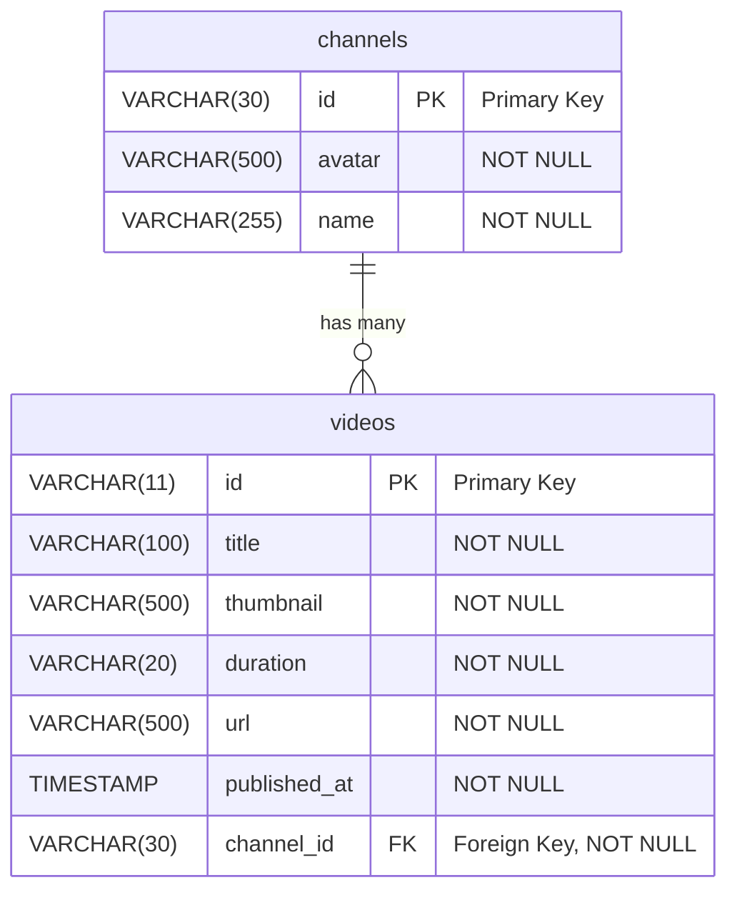

```mermaid
erDiagram
    channels {
        VARCHAR(30) id PK "Primary Key"
        VARCHAR(500) avatar "NOT NULL"
        VARCHAR(255) name "NOT NULL"
    }

    videos {
        VARCHAR(11) id PK "Primary Key"
        VARCHAR(100) title "NOT NULL"
        VARCHAR(500) thumbnail "NOT NULL"
        VARCHAR(20) duration "NOT NULL"
        VARCHAR(500) url "NOT NULL"
        TIMESTAMP published_at "NOT NULL"
        VARCHAR(30) channel_id FK "Foreign Key, NOT NULL"
    }

    channels ||--o{ videos : "has many"
```
