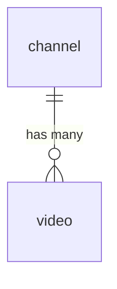

[CodeTube](https://faketube.app/)

In the last episode, we established a **solid backend foundation** using a traditional **REST API** with **API Gateway**, **Lambda**, and an **Aurora Serverless PostgreSQL database**. This approach works well, but in the world of modern cloud-native architectures, we often explore alternative patterns to address different needs, especially regarding data fetching efficiency and flexibility.

This time, we're shifting our focus to a **modern approach** using a **GraphQL-based API** with **[AWS AppSync](https://aws.amazon.com/appsync)** and a **NoSQL database**, **[Amazon DynamoDB](https://aws.amazon.com/dynamodb/)**. This will allow us to compare the database modeling process, performance, and scalability of both solutions. We'll continue to leverage **Infrastructure as Code (IaC)** with the **[AWS Cloud Development Kit (CDK)](https://aws.amazon.com/cdk/)** to define and deploy our resources.

Our **high-level architecture diagram** will now evolve to incorporate these new GraphQL components - AppSync, DynamoDB and (optional) Lambda function.


**The sequence diagram** is worth a thousand words. This high level diagram shows **two variants** of our architecture:


1) **Lambda resolver** as an intermediary between AppSync and DynamoDB

_First it runs DynamoDB `Query` command to get a paginated list of `videos` sorted by `publishedAt` and then runs `BatchGetItem` query to get `channels` for those videos and merges the two results._ 

2) **DynamoDB resolver** to directly integrate AppSync with DynamoDB

_First it queries DynamoDB for the paginated list of `videos` sorted by `publishedAt` and then it uses a [field-level resolver](https://aws.amazon.com/blogs/mobile/aws-appsync-field-level-resolvers-enhancing-graphql-api-development/) to get the `channel` for each video._

We will **discuss, implement and compare both variants**.

Let's dive in!

## Database

For this iteration, we're moving to a **NoSQL database** and our solution of choice will be **[Amazon DynamoDB](https://aws.amazon.com/dynamodb/)** a key-value database designed for high performance or as AWS put it in the tagline: 

> Serverless, fully managed, distributed NoSQL database with single-digit millisecond performance at any scale

Before we can store any data, we **need a "blueprint"**. Just as we defined our relational schema with an ERD (Entity Relationship Diagram) and DDL (Data Definition Language) statements previously, we must now **design a schema** tailored for our **NoSQL database**. 

### Schema

Unlike the rigid structure of relational databases with predefined tables and relationships, NoSQL databases like DynamoDB offer a more **flexible model**.

#### Single table design

One of the most **powerful and initially counterintuitive concepts** in DynamoDB is **[single-table design](https://docs.aws.amazon.com/amazondynamodb/latest/developerguide/data-modeling-foundations.html#data-modeling-foundations-single)**. While our relational background taught us to normalize data into separate tables (like `videos` and `channels`), with this approach, we'll **store different types of items within a single table**.

DynamoDB **does not support the complex join operations** that are fundamental to relational databases like PostgreSQL. This absence of joins is a **key motivator for the single-table design pattern**.

By leveraging **generic primary keys** like **PK (Partition Key)**, **SK (Sort Key)** and additional indexes like **GSI (Global Secondary Indexes)** or **LSI (Local Secondary Indexes)**, we can efficiently model relationships between data and create highly performant queries.

I highly recommend watching [Fundamentals of Amazon DynamoDB Single Table Design with Rick Houlihan](https://www.youtube.com/watch?v=KYy8X8t4MB8&ab_channel=ServerlessLand) to better understand the modelling process.


#### ERD (Entity Relationship Diagram)

As a first step, let's visualize our (super simple) **ERD diagram** and the **relationship between videos and channels** using [Mermaid ERD (Entity Relationship Diagram)](https://mermaid.js.org/syntax/entityRelationshipDiagram.html)

`cloud/lib/dynamodb-erd.md`




#### Access patterns

Now, let's try to **identify** all the **access patterns** for the Home page feature (plus let's think also about the incoming Watch page feature).

| Identified Access Patterns            | Feature    |
| ------------------------------------- | ---------- |
| Get all videos sorted by `publishedAt`| Home page  |
| Get channel by `channelId`            | Home page  |
| Get video by `videoId`                | Watch page |

Let's also go through all those access patterns and think which **Table**, **GSI (Global Secondary Index)** or **LSI (Local Secondary Index)** we have to query to get a given result. What are the **key conditions** or **filter expressions** needed?

| Access Pattern | Table/GSI/LSI | Key Condition |
| -------------- | ------------- | ------------- |
| Get all videos sorted by `publishedAt`|GSI1|GSI1_PK="video"|PK="video"|
|Get channel by `channelId`|Table|PK=channelId and SK=channelId<br /><br /> _Example_<br />_PK="c#AmazonNovaReel" and SK="c#AmazonNovaReel"_|
|Get video by `videoId`|Table|PK=videoId and SK=videoId<br /><br /> _Example_<br />_PK="v#q9Gm7a6Wwjk" and SK="v#q9Gm7a6Wwjk"_|

#### NoSQL Workbench

Let's create the data model in **[NoSQL Workbench for DynamoDB](https://docs.aws.amazon.com/amazondynamodb/latest/developerguide/workbench.html)** - **cross-platform GUI application** that you can use for modern database development and operations.


##### Data model

Click **"Create new data model"** from the **"Getting started"** section on the top-right. Click **"Select"** from the **"Make model from scratch"** section on the left. Fill out the form like this:

| Field       | Value           |
| ----------- | --------------- |
| Name        | CodeTube        |
| Author      | Jacek Kościesza |
| Description | YouTube clone   |

and finally click the **"Create"** button.

##### DynamoDB table

Now let's create a DynamoDB table. Click the **"Create new table"** button from the **"No table selected"** section located in the centre.

Complete the form as follows:

|||
|-|-|
| Table name | CodeTube |

In the **"Primary key attributes"** section check **"Add sort key"** option and define both - partition and sort keys:

||||
|-|-|-|
| Partition key | PK | String |
| Sort key      | SK | String |

In the **"Other attributes"** click **"Add an attribute"** button and create all the needed attributes:

| Attribute name | Attribute type |
| -------------- | -------------- |
| GSI1_PK        | String         |
| GSI1_SK        | String         |
| EntityType     | String         |
| id             | String         |
| avatar         | String         |
| name           | String         |
| title          | String         |
| thumbnail      | String         |
| duration       | String         |
| url            | String         |
| publishedAt    | String         |
| channelId      | String         |

In the **"Global secondary indexes"** section click **"Add global secondary index"**, check **"Add sort key"** option and fill the form like this:

|||
|-|-|
| Global secondary index name | GSI1    |
| Partition key               | GSI1_PK |
| Sort key                    | GSI1_SK |
| Projection type             | ALL     |

Finally click the **"Add table definition"** button.

Here's that **exported data model** after those steps:

`cloud/lib/NoSQL_Workbench_model_#1.json`

```json
{
  "ModelName": "FakeTube",
  "ModelMetadata": {
    "Author": "Jacek Kościesza",
    "DateCreated": "Sep 23, 2025, 06:15 PM",
    "DateLastModified": "Sep 23, 2025, 06:28 PM",
    "Description": "YouTube clone",
    "AWSService": "Amazon DynamoDB",
    "Version": "3.0"
  },
  "DataModel": [
    {
      "TableName": "FakeTube",
      "KeyAttributes": {
        "PartitionKey": {
          "AttributeName": "PK",
          "AttributeType": "S"
        },
        "SortKey": {
          "AttributeName": "SK",
          "AttributeType": "S"
        }
      },
      "NonKeyAttributes": [
        {
          "AttributeName": "GSI1_PK",
          "AttributeType": "S"
        },
        {
          "AttributeName": "GSI1_SK",
          "AttributeType": "S"
        },
        {
          "AttributeName": "EntityType",
          "AttributeType": "S"
        },
        {
          "AttributeName": "id",
          "AttributeType": "S"
        },
        {
          "AttributeName": "avatar",
          "AttributeType": "S"
        },
        {
          "AttributeName": "name",
          "AttributeType": "S"
        },
        {
          "AttributeName": "title",
          "AttributeType": "S"
        },
        {
          "AttributeName": "thumbnail",
          "AttributeType": "S"
        },
        {
          "AttributeName": "duration",
          "AttributeType": "S"
        },
        {
          "AttributeName": "url",
          "AttributeType": "S"
        },
        {
          "AttributeName": "publishedAt",
          "AttributeType": "S"
        },
        {
          "AttributeName": "channelId",
          "AttributeType": "S"
        }
      ],
      "GlobalSecondaryIndexes": [
        {
          "IndexName": "GSI1",
          "KeyAttributes": {
            "PartitionKey": {
              "AttributeName": "GSI1_PK",
              "AttributeType": "S"
            },
            "SortKey": {
              "AttributeName": "GSI1_SK",
              "AttributeType": "S"
            }
          },
          "Projection": {
            "ProjectionType": "ALL"
          }
        }
      ],
      "DataAccess": {
        "MySql": {}
      },
      "SampleDataFormats": {},
      "BillingMode": "PAY_PER_REQUEST"
    }
  ]
}
```

##### Data

Now let's add some data. Click the **"Visualizer"** tab in the side menu, then click the **"Actions"** button in the top-right corner and select the **"Edit data"** option.

We will start with minimalistic example with only one `channel` and one `video`: 

| Attribute name | Attribute value                             |
| -------------- | ------------------------------------------- |
| PK             | c#AmazonNovaReel                            |
| SK             | c#AmazonNovaReel                            | 
| EntityType     | channel                                     |
| id             | AmazonNovaReel                              |
| avatar         | /channels/AmazonNovaReel/AmazonNovaReel.png | 
| name           | Amazon Nova Reel                            |

| Attribute name | Attribute value                             |
| -------------- | ------------------------------------------- |
| PK             | v#q9Gm7a6Wwjk                               |
| SK             | v#q9Gm7a6Wwjk                               |
| GSI1_PK        | video                                       |
| GSI1_SK        | 2025-03-03T15:58:23Z                        |
| EntityType     | video                                       |
| title          | The Amazing World of Octopus!               |
| thumbnail      | /videos/q9Gm7a6Wwjk/q9Gm7a6Wwjk.png         |
| duration       | /videos/q9Gm7a6Wwjk/q9Gm7a6Wwjk.mp4         |
| publishedAt    | 2025-03-03T15:58:23Z                        |
| channelId      | AmazonNovaReel                              |

Here's how our **exported data model** changed after those steps:

`cloud/lib/NoSQL_Workbench_model_#2.json` (_diff_)

```diff
...
      "GlobalSecondaryIndexes": [
        {
          "IndexName": "GSI1",
          "KeyAttributes": {
            "PartitionKey": {
              "AttributeName": "GSI1_PK",
              "AttributeType": "S"
            },
            "SortKey": {
              "AttributeName": "GSI1_SK",
              "AttributeType": "S"
            }
          },
          "Projection": {
            "ProjectionType": "ALL"
          }
        }
      ],
+     "TableData": [
+       {
+         "PK": {
+           "S": "c#AmazonNovaReel"
+         },
+         "SK": {
+           "S": "c#AmazonNovaReel"
+         },
+         "EntityType": {
+           "S": "channel"
+         },
+         "id": {
+           "S": "AmazonNovaReel"
+         },
+         "avatar": {
+           "S": "/channels/AmazonNovaReel/AmazonNovaReel.png"
+         },
+         "name": {
+           "S": "Amazon Nova Reel"
+         }
+       },
+       {
+         "PK": {
+           "S": "v#q9Gm7a6Wwjk"
+         },
+         "SK": {
+           "S": "v#q9Gm7a6Wwjk"
+         },
+         "GSI1_PK": {
+           "S": "video"
+         },
+         "GSI1_SK": {
+           "S": "2025-03-03T15:58:23Z"
+         },
+         "EntityType": {
+           "S": "video"
+         },
+         "id": {
+           "S": "q9Gm7a6Wwjk"
+         },
+         "title": {
+           "S": "The Amazing World of Octopus!"
+         },
+         "thumbnail": {
+           "S": "/videos/q9Gm7a6Wwjk/q9Gm7a6Wwjk.png"
+         },
+         "duration": {
+           "S": "PT0M6.214542S"
+         },
+         "url": {
+           "S": "/videos/q9Gm7a6Wwjk/q9Gm7a6Wwjk.mp4"
+         },
+         "publishedAt": {
+           "S": "2025-03-03T15:58:23Z"
+         },
+         "channelId": {
+           "S": "AmazonNovaReel"
+         }
+       }
+     ],
      "DataAccess": {
        "MySql": {}
      },
      "SampleDataFormats": {},
      "BillingMode": "PAY_PER_REQUEST"
    }
  ]
}
```

Finally, let's add the rest of our videos. You can find the final JSON file with the exported data model here:

[cloud/lib/NoSQL_Workbench_model_#3.json](https://github.com/JacekKosciesza/FakeTube/blob/eb5b47ac47c1945f7d6450055db2072a6f67eaf7/cloud/lib/NoSQL_Workbench_model_%233.json)

GitHub: [feat(home): nosql workbench model (#7)](https://github.com/JacekKosciesza/FakeTube/commit/eb5b47ac47c1945f7d6450055db2072a6f67eaf7)

### DynamoDB

Moving on, let's translate all of that to the **AWS CDK construct**.

`cloud/lib/dynamodb.ts`

```ts
import * as cdk from "aws-cdk-lib";
import * as dynamodb from "aws-cdk-lib/aws-dynamodb";
import { Construct } from "constructs";

export class DynamoDB extends Construct {
  public table: dynamodb.Table;

  constructor(scope: Construct, id: string) {
    super(scope, id);

    this.table = new dynamodb.Table(this, "dynamodb-table", {
      tableName: "FakeTube",
      partitionKey: {
        name: "PK",
        type: dynamodb.AttributeType.STRING,
      },
      sortKey: {
        name: "SK",
        type: dynamodb.AttributeType.STRING,
      },
      billingMode: dynamodb.BillingMode.PAY_PER_REQUEST,
      removalPolicy: cdk.RemovalPolicy.DESTROY,
    });

    this.table.addGlobalSecondaryIndex({
      partitionKey: { name: "GSI1_PK", type: dynamodb.AttributeType.STRING },
      indexName: "GSI1",
      sortKey: { name: "GSI1_SK", type: dynamodb.AttributeType.STRING },
      projectionType: dynamodb.ProjectionType.ALL,
    });

    new cdk.CfnOutput(this, "DynamoDBTableExport", {
      value: this.table.tableName,
    });
  }
}
```

It's worth noting two options, which we didn't discuss in NoSQL Workbench section.

<dl>
  <dt>billingMode</dt>
  <dd>Set to <strong>PAY_PER_REQUEST</strong>, which is a flexible billing option capable of serving requests without capacity planning.</dd>

  <dt>removalPolicy</dt>
  <dd>Set to <strong>DESTROY</strong>, which will delete the table during stack deletion. <strong>WARNING</strong>: this is fine for <em>development</em> environment, but for <em>production</em> environment we will have to change it to <strong>RETAIN</strong> or <strong>SNAPSHOT</strong></dd>

</dl>

#### Stack

Now, let's **deploy the stack** with our DynamoDB table.

`cloud/lib/faketube-stack.ts` (_diff_)

```diff
import * as cdk from "aws-cdk-lib";
import { Construct } from "constructs";

import { Aurora } from "./aurora";
+import { DynamoDB } from "./dynamodb";
import { Gateway } from "./gateway";
import { Home } from "./home";
import { VPC } from "./vpc";

export class FakeTubeStack extends cdk.Stack {
  constructor(scope: Construct, id: string, props?: cdk.StackProps) {
    super(scope, id, props);

    const vpc = new VPC(this, "vpc");
    const aurora = new Aurora(this, "aurora", { vpc });
+   new DynamoDB(this, "dynamodb");
    const gateway = new Gateway(this, "gateway");

    new Home(this, "home", {
      aurora,
      gateway,
    });
  }
}
```

`cloud/lib/faketube-stack.ts`

```ts
import * as cdk from "aws-cdk-lib";
import { Construct } from "constructs";

import { Aurora } from "./aurora";
import { DynamoDB } from "./dynamodb";
import { Gateway } from "./gateway";
import { Home } from "./home";
import { VPC } from "./vpc";

export class FakeTubeStack extends cdk.Stack {
  constructor(scope: Construct, id: string, props?: cdk.StackProps) {
    super(scope, id, props);

    const vpc = new VPC(this, "vpc");
    const aurora = new Aurora(this, "aurora", { vpc });
    new DynamoDB(this, "dynamodb");
    const gateway = new Gateway(this, "gateway");

    new Home(this, "home", {
      aurora,
      gateway,
    });
  }
}
```

Just a final check with `cdk diff` what will be created:


and we can run `cdk deploy`.

GitHub: [feat(home): dynamodb (#7)](https://github.com/JacekKosciesza/FakeTube/commit/85d1a8621730ff9d9e9d06dddb0e2c27eb4840c3)

### Seed

To **seed our database** with data we will use [AWS CLI](https://aws.amazon.com/cli/) and [batch-write-item](https://docs.aws.amazon.com/cli/latest/reference/dynamodb/batch-write-item.html) command.

#### Channels

Let's start with `channels`. We will first prepare **JSON file** with **PutRequest** commands:

`cloud/lib/channels.seed.json`

```json
{
  "FakeTube": [
    {
      "PutRequest": {
        "Item": {
          "PK": {
            "S": "c#AmazonNovaReel"
          },
          "SK": {
            "S": "c#AmazonNovaReel"
          },
          "EntityType": {
            "S": "channel"
          },
          "id": {
            "S": "AmazonNovaReel"
          },
          "avatar": {
            "S": "/channels/AmazonNovaReel/AmazonNovaReel.png"
          },
          "name": {
            "S": "Amazon Nova Reel"
          }
        }
      }
    }
  ]
}
```

and we are ready to invoke `batch-write-item` command:

```
aws dynamodb batch-write-item --request-items file://lib/channels.seed.json
```

```
{
    "UnprocessedItems": {}
}
```

Tye `UnprocessedItems` object is empty, which means that everything was processed successfully.

#### Videos

Next, `videos` data. We can't put everything into one big JSON file. We will have to divide it into **maximum 25 command chunks**, otherwise we will get an error like this:

```
failed to satisfy constraint: Map value must satisfy constraint: [Member must have length less than or equal to 25, Member must have length greater than or equal to 1]
```

So, let's create **two separate files**, first one with **25 commands**, second one with **7 commands**, which gives our **32 videos in total** from the initial video set prepared earlier.

`cloud/lib/videos_#1.seed.json`

```json
{
  "FakeTube": [
    {
      "PutRequest": {
        "Item": {
          "PK": {
            "S": "v#q9Gm7a6Wwjk"
          },
          "SK": {
            "S": "v#q9Gm7a6Wwjk"
          },
          "GSI1_PK": {
            "S": "video"
          },
          "GSI1_SK": {
            "S": "2025-03-03T15:58:23Z"
          },
          "EntityType": {
            "S": "video"
          },
          "id": {
            "S": "q9Gm7a6Wwjk"
          },
          "title": {
            "S": "The Amazing World of Octopus!"
          },
          "thumbnail": {
            "S": "/videos/q9Gm7a6Wwjk/q9Gm7a6Wwjk.png"
          },
          "duration": {
            "S": "PT0M6.214542S"
          },
          "url": {
            "S": "/videos/q9Gm7a6Wwjk/q9Gm7a6Wwjk.mp4"
          },
          "publishedAt": {
            "S": "2025-03-03T15:58:23Z"
          },
          "channelId": {
            "S": "AmazonNovaReel"
          }
        }
      }
    },
    {
      "PutRequest": {
        "Item": {
          "PK": {
            "S": "v#QYUGZ3ueoHQ"
          },
          "SK": {
            "S": "v#QYUGZ3ueoHQ"
          },
          "GSI1_PK": {
            "S": "video"
          },
          "GSI1_SK": {
            "S": "2025-03-03T14:22:54Z"
          },
          "EntityType": {
            "S": "video"
          },
          "id": {
            "S": "QYUGZ3ueoHQ"
          },
          "title": {
            "S": "Magic Wheels: The Future of Cars"
          },
          "thumbnail": {
            "S": "/videos/QYUGZ3ueoHQ/QYUGZ3ueoHQ.png"
          },
          "duration": {
            "S": "PT0M6.047708S"
          },
          "url": {
            "S": "/videos/QYUGZ3ueoHQ/QYUGZ3ueoHQ.mp4"
          },
          "publishedAt": {
            "S": "2025-03-03T14:22:54Z"
          },
          "channelId": {
            "S": "AmazonNovaReel"
          }
        }
      }
    },
    ... (23 more)
  ]
}
```

`cloud/lib/videos_#2.seed.json`

```json
{
  "FakeTube": [
    {
      "PutRequest": {
        "Item": {
          "PK": {
            "S": "v#SJOCLMEuoh0"
          },
          "SK": {
            "S": "v#SJOCLMEuoh0"
          },
          "GSI1_PK": {
            "S": "video"
          },
          "GSI1_SK": {
            "S": "2025-03-07T14:20:26Z"
          },
          "EntityType": {
            "S": "video"
          },
          "id": {
            "S": "SJOCLMEuoh0"
          },
          "title": {
            "S": "Tree Guardians: Protecting Nature's Champions"
          },
          "thumbnail": {
            "S": "/videos/SJOCLMEuoh0/SJOCLMEuoh0.png"
          },
          "duration": {
            "S": "PT0M6.047708S"
          },
          "url": {
            "S": "/videos/SJOCLMEuoh0/SJOCLMEuoh0.mp4"
          },
          "publishedAt": {
            "S": "2025-03-07T14:20:26Z"
          },
          "channelId": {
            "S": "AmazonNovaReel"
          }
        }
      }
    },
    {
      "PutRequest": {
        "Item": {
          "PK": {
            "S": "v#M8V1FcKde2g"
          },
          "SK": {
            "S": "v#M8V1FcKde2g"
          },
          "GSI1_PK": {
            "S": "video"
          },
          "GSI1_SK": {
            "S": "2025-03-07T14:36:03Z"
          },
          "EntityType": {
            "S": "video"
          },
          "id": {
            "S": "M8V1FcKde2g"
          },
          "title": {
            "S": "Street Volunteers: Collecting for a Cause"
          },
          "thumbnail": {
            "S": "/videos/M8V1FcKde2g/M8V1FcKde2g.png"
          },
          "duration": {
            "S": "PT0M6.047708S"
          },
          "url": {
            "S": "/videos/M8V1FcKde2g/M8V1FcKde2g.mp4"
          },
          "publishedAt": {
            "S": "2025-03-07T14:36:03Z"
          },
          "channelId": {
            "S": "AmazonNovaReel"
          }
        }
      }
    },
    ... (5 more)
  ]
}
```

Let's invoke `batch-write-item` commands:

```
aws dynamodb batch-write-item --request-items file://lib/videos_#1.seed.json
```

```
{
    "UnprocessedItems": {}
}
```

```
aws dynamodb batch-write-item --request-items file://lib/videos_#2.seed.json
```

```
{
    "UnprocessedItems": {}
}
```

Seems that it all worked. We can verify it using **AWS Console** and **Explore table items** feature:


GitHub: [feat(home): dynamodb seed (#7)](https://github.com/JacekKosciesza/FakeTube/commit/c624e93245f5a3f6b8b279b77fd929d1e98332ad)

## API

This time, we're building our API with **[GraphQL](https://graphql.org/)** instead of the traditional REST API. But why?

GraphQL is an **open-source query language** for APIs and a **server-side runtime created by Facebook**, open-sourced about 10 years ago. Since then, its adoption and ecosystem have grown immensely. A key difference is that with GraphQL, the client requests **exactly the data it needs**, solving the common REST problems of **over-fetching** (getting too much data) and **under-fetching** (needing multiple requests).

For this project, we'll use **[AWS AppSync](https://aws.amazon.com/appsync/)**, a dedicated service on Amazon Web Services that simplifies building a GraphQL API.

Key characteristics of GraphQL:


<dl>
  <dt><strong>Product-centric</strong></dt>
  <dd>Designed to meet the needs of the client.</dd>

  <dt><strong>Hierarchical</strong></dt>
  <dd>Data is structured intuitively, reflecting its relationships.</dd>

  <dt><strong>Strong-typing</strong></dt>
  <dd>All data is defined by a schema, ensuring a clear contract.</dd>


  <dt><strong>Client-specified response</strong></dt>
  <dd>The client is in control of the data it receives.</dd>


  <dt><strong>Self-documenting</strong></dt>
  <dd>The API's capabilities are automatically known, making it easy to explore and use.</dd>

</dl>

You can dive deeper into its principles on the official **[Introduction to GraphQL](https://graphql.org/learn/)** documentation.

### Schema

Time to design the API! We'll do that by defining a **[GraphQL schema](https://graphql.org/learn/schema/)**. There are **three main operation types** supported by GraphQL:
- **[Query](https://graphql.org/learn/queries/)** - fetch data from a GraphQL server
- **[Mutation](https://graphql.org/learn/mutations/)** - modify data with a GraphQL server
- **[Subscription](https://graphql.org/learn/subscriptions/)** - get real-time updates from a GraphQL server

The GraphQL **type system is extendable** and AWS AppSync takes advantage of that by defining its own types like `AWSDateTime` (which we are going to use). For the complete list see **[AWS AppSync scalars](https://docs.aws.amazon.com/appsync/latest/devguide/scalars.html)**.

Our tooling will have to be aware of those types, so let's define those types in the `cloud/lib/root.graphql`:

```graphql
type Query
type Mutation
type Subscription

scalar AWSDateTime
```

With that done, we can now create our own [object types](https://spec.graphql.org/draft/#sec-Objects) like `Channel` , `Video`, `VideosPage` and **extend Query type** with our own operation like `listVideos`:

`cloud/lib/home/home.graphql`

```graphql
type Channel {
  id: ID!
  avatar: String!
  name: String!
}

type Video {
  id: ID!
  title: String!
  thumbnail: String!
  duration: String!
  url: String!
  publishedAt: AWSDateTime!
  channel: Channel!
}

type VideosPage {
  items: [Video!]!
  nextToken: String
}

extend type Query {
  listVideos(nextToken: String, limit: Int = 24): VideosPage!
}
```

We will have to **merge our schema files** into **one `schema.graphql` file**, which we will send to AWS AppSync. Lucky for us, there is a **CLI tool** for that: **[graphql-schema-utilities](https://github.com/awslabs/graphql-schema-utilities)**.

Let's install it:

```
npm install --save-dev graphql-schema-utilities
```

and add a **`graphql` command** to the `package.json` which will **merge our schema files**:

`cloud/package.json` _(diff)_

```diff 
  "scripts": {
    "build": "tsc",
    "watch": "tsc -w",
    "test": "jest",
-   "cdk": "cdk"
+   "cdk": "cdk",
+   "graphql": "rm -f ./lib/schema.graphql && graphql-schema-utilities --includeDirectives --schema \"{root.graphql,./lib/**/*.graphql}\" --output ./lib/schema.graphql"
  },
```

Now, let's run it and verify if `schema.graphql` files was created:

```
npm run graphql
```

`cloud/lib/schema.graphql`

```graphql
schema { 
  query: Query 
  mutation: Mutation 
  subscription: Subscription  
}

scalar AWSDateTime

type Channel {
  id: ID!
  avatar: String!
  name: String!
}

type Mutation

type Query {
  listVideos(nextToken: String, limit: Int = 24): VideosPage!
}

type Subscription

type Video {
  id: ID!
  title: String!
  thumbnail: String!
  duration: String!
  url: String!
  publishedAt: AWSDateTime!
  channel: Channel!
}

type VideosPage {
  items: [Video!]!
  nextToken: String
}
```

All worked as expected.

GitHub: [feat(home): graphql schema (#7)](https://github.com/JacekKosciesza/FakeTube/commit/1bc41cd16e6f19920b876790fd4622b282412e96)

### AppSync

We will now focus on the **[AWS AppSync](https://aws.amazon.com/appsync/)** - **serverless GraphQL** and Pub/Sub API. As far as I know it's a very **unique service** and there is no direct one-to-one equivalent (in terms of GraphQL features) in other cloud providers like [Microsoft Azure](https://azure.microsoft.com/) or [Google Cloud](https://cloud.google.com/). 

Next up, we will define our `AppSync` construct using [AWS CDK](https://docs.aws.amazon.com/cdk/api/v2/docs/aws-cdk-lib.aws_appsync-readme.html):

`cloud/lib/appsync.ts`

```ts
import * as appsync from "aws-cdk-lib/aws-appsync";
import * as cdk from "aws-cdk-lib";
import * as path from "path";
import { Construct } from "constructs";

import { DynamoDB } from "./dynamodb";

interface Props extends cdk.StackProps {
  dynamodb: DynamoDB;
}

export class AppSync extends Construct {
  public api: appsync.GraphqlApi;
  public dynamodbDS: appsync.DynamoDbDataSource;

  constructor(scope: Construct, id: string, { dynamodb }: Props) {
    super(scope, id);

    this.api = new appsync.GraphqlApi(this, "appsync-graphql-api", {
      name: "faketube",
      definition: appsync.Definition.fromFile(
        path.join(__dirname, "schema.graphql")
      ),
      authorizationConfig: {
        defaultAuthorization: {
          authorizationType: appsync.AuthorizationType.API_KEY,
          apiKeyConfig: {
            expires: cdk.Expiration.after(cdk.Duration.days(365)),
          },
        },
      },
    });

    this.dynamodbDS = this.api.addDynamoDbDataSource(
      "faketube",
      dynamodb.table
    );

    new cdk.CfnOutput(this, "GraphQLUrlExport", {
      value: this.api.graphqlUrl,
    });

    new cdk.CfnOutput(this, "GraphQLApiKeyExport", {
      value: this.api.apiKey || "",
    });
  }
}
```

It's not very complicated, two things worth noting:

<dl>
  <dt><strong>definition</strong></dt>
  <dd>Set to our merged <strong>schema definition</strong> file <code>schema.graphql</code></dd>

  <dt><strong>authorizationConfig</strong></dt>
  <dd>Set <strong>default authorization</strong> to <strong>API Keys</strong>. <strong>WARNING</strong>: we set <strong>expiration time of our API Key to 365 days</strong>, which is fine for our experiments, but can introduce a security vulnerability for the production environment, so we will have to fix that later</dd>

<dt><strong>dynamodbDS</strong></dt>
<dd>We also defined <strong>DynamoDB data source</strong>, which we will use to create our DynamoDB resolvers</dd>

</dl>

#### Stack

Time to add our `AppSync` construct to the stack and **deploy it**.

`cloud/lib/faketube-stack.ts` (_diff_)

```diff
import * as cdk from "aws-cdk-lib";
import { Construct } from "constructs";

+import { AppSync } from "./appsync";
import { Aurora } from "./aurora";
import { DynamoDB } from "./dynamodb";
import { Gateway } from "./gateway";
import { Home } from "./home";
import { VPC } from "./vpc";

export class FakeTubeStack extends cdk.Stack {
  constructor(scope: Construct, id: string, props?: cdk.StackProps) {
    super(scope, id, props);

    const vpc = new VPC(this, "vpc");
    const aurora = new Aurora(this, "aurora", { vpc });
-   new DynamoDB(this, "dynamodb");
+   const dynamodb = new DynamoDB(this, "dynamodb");
    const gateway = new Gateway(this, "gateway");
+   new AppSync(this, "appsync", { dynamodb });

    new Home(this, "home", {
      aurora,
      gateway,
    });
  }
}
```

```
cdk diff
```


```
cdk deploy
```


Good time to save our **exported outputs** from the stack (**API Key** and **GraphQL endpoint URL**) as **environment variables**.

```
export FAKETUBE_AWS_APPSYNC_GRAPHQL_API_KEY=da2-7f7v2t5b5zd2noa6ut7xlbu6gu
export FAKETUBE_AWS_APPSYNC_GRAPHQL_ENDPOINT=https://5tzz3rnyjrhldnpnsnf4dyf6ea.appsync-api.eu-west-1.amazonaws.com/graphql
```

GitHub: [feat(home): appsync (#7)](https://github.com/JacekKosciesza/FakeTube/commit/7b12338e67a02f9b8c8739cce95d7c3d4e90121e)

### Home

Our next step is to create **two variants** of our architecture, highlighted in the **sequence diagram** from the introduction section:

- DynamoDB resolver
- Lambda resolver 

#### DynamoDB resolver

`cloud/lib/home/home.ts` (_diff_)

```diff
import * as apigw from "aws-cdk-lib/aws-apigateway";
import * as path from "path";
import * as lambda from "aws-cdk-lib/aws-lambda";
import * as apigwv2 from "aws-cdk-lib/aws-apigatewayv2";
import { Construct } from "constructs";
import { HttpLambdaIntegration } from "aws-cdk-lib/aws-apigatewayv2-integrations";

+import { AppSync } from "../appsync";
+import { AppsyncResolver } from "../appsyncResolver";
import { Aurora } from "../aurora";
import { Gateway } from "../gateway";
import { Lambda } from "../lambda";

interface Props {
+ appsync: AppSync;
  aurora: Aurora;
  gateway: Gateway;
}

export class Home extends Construct {
-  constructor(scope: Construct, id: string, { aurora, gateway }: Props) {
+  constructor(
+    scope: Construct,
+    id: string,
+    { appsync, aurora, gateway }: Props
+  ) {
    super(scope, id);

    const listVideosLambda = new Lambda(this, "listVideos", {
      name: "listVideos",
      description: "Retrieve a paginated list of videos",
      entry: path.join(__dirname, "functions", "listVideos.lambda.ts"),
      environment: {
        SERVICE_NAME: "Home",
        LOG_LEVEL: "INFO",
        AURORA_SECRET_ARN: aurora.credentials.secretArn,
        AURORA_CLUSTER_ARN: aurora.cluster.clusterArn,
        AURORA_DATABASE_NAME: aurora.defaultName,
      },
    });
    aurora.cluster.grantDataApiAccess(listVideosLambda.function);

+   this.dynamodbResolver(appsync);
    this.rest(gateway.rest, listVideosLambda.function);
    this.http(gateway.http, listVideosLambda.function);
  }

+  dynamodbResolver(appsync: AppSync): void {
+    new AppsyncResolver(this, "listVideosResolver", {
+      name: "listVideos",
+      typeName: "Query",
+      entry: path.join(__dirname, "resolvers", "listVideos.resolver.js"),
+      appsync,
+    });
+
+    new AppsyncResolver(this, "getChannelResolver", {
+      name: "channel",
+      typeName: "Video",
+      entry: path.join(__dirname, "resolvers", "getChannel.resolver.js"),
+      appsync,
+    });
+  }

  rest(rest: apigw.RestApi, handler: lambda.IFunction): void {
    const videos = rest.root.addResource("videos", {
      defaultCorsPreflightOptions: {
        allowHeaders: apigw.Cors.DEFAULT_HEADERS,
        allowMethods: ["GET", "OPTIONS"],
        allowOrigins: this.node.tryGetContext("corsOrigins") || [],
      },
    });

    videos.addMethod("GET", new apigw.LambdaIntegration(handler));
  }

  http(http: apigwv2.HttpApi, handler: lambda.IFunction): void {
    const integration = new HttpLambdaIntegration("VideosIntegration", handler);

    http.addRoutes({
      path: "/videos",
      methods: [apigwv2.HttpMethod.GET],
      integration,
    });
  }
}
```

We actually create two resolvers here. One is **`listVideos` query resolvers** and second one is **`channel` field resolver**. In order to reduce a boilerplate, we also created **`AppsyncResolver ` helper construct**, which looks like this:

`cloud/lib/appsyncResolver.ts`

```ts
import * as aws_appsync from "aws-cdk-lib/aws-appsync";
import { Construct } from "constructs";

import { AppSync } from "./appsync";

interface Props {
  name: string;
  typeName: string;
  entry: string;
  appsync: AppSync;
  dataSource?: aws_appsync.BaseDataSource;
}

export class AppsyncResolver extends Construct {
  public resolver: aws_appsync.Resolver;

  constructor(
    scope: Construct,
    id: string,
    { name, typeName, entry, appsync, dataSource }: Props
  ) {
    super(scope, id);

    this.resolver = new aws_appsync.Resolver(this, name, {
      api: appsync.api,
      fieldName: name,
      typeName,
      dataSource: dataSource || appsync.dynamodbDS,
      code: aws_appsync.Code.fromAsset(entry),
      runtime: aws_appsync.FunctionRuntime.JS_1_0_0,
    });
  }
}
```

Those (`listVideos` and `getChannel`) are [JavaScript resolvers](https://docs.aws.amazon.com/appsync/latest/devguide/resolver-reference-overview-js.html), which are defined like this:

`cloud/lib/home/resolvers/listVideos.resolver.js`

```js
import * as ddb from "@aws-appsync/utils/dynamodb";

export function request(ctx) {
  const nextToken = ctx.args.nextToken;
  const limit = ctx.args.limit;

  return ddb.query({
    query: {
      GSI1_PK: { eq: "video" },
    },
    index: "GSI1",
    scanIndexForward: true,
    limit,
    nextToken,
  });
}

export function response(ctx) {
  if (ctx.error) {
    util.error(ctx.error.message, ctx.error.type);
  }

  const videos = ctx.result.items || [];
  const nextToken = ctx.result.nextToken;

  const page = {
    items: videos,
    nextToken,
  };

  return page;
}
```

`cloud/lib/home/resolvers/getChannel.resolver.js`

```js
import { get } from "@aws-appsync/utils/dynamodb";
import { util } from "@aws-appsync/utils";

export function request(ctx) {
  const channelId = ctx.source.channelId;

  return get({
    key: {
      PK: `c#${channelId}`,
      SK: `c#${channelId}`,
    },
  });
}

export function response(ctx) {
  if (ctx.error) {
    util.error(ctx.error.message, ctx.error.type);
  }

  const channel = ctx.result;

  return channel;
}
```

As a final step, let's **update our stack**, **deploy it** and **test** our GraphQL API **using [cURL](https://curl.se/)**.

`cloud/faketube-stack.ts` (_diff_)

```diff
import * as cdk from "aws-cdk-lib";
import { Construct } from "constructs";

import { AppSync } from "./appsync";
import { Aurora } from "./aurora";
import { DynamoDB } from "./dynamodb";
import { Gateway } from "./gateway";
import { Home } from "./home";
import { VPC } from "./vpc";

export class FakeTubeStack extends cdk.Stack {
  constructor(scope: Construct, id: string, props?: cdk.StackProps) {
    super(scope, id, props);

    const vpc = new VPC(this, "vpc");
    const aurora = new Aurora(this, "aurora", { vpc });
    const dynamodb = new DynamoDB(this, "dynamodb");
    const gateway = new Gateway(this, "gateway");
-   new AppSync(this, "appsync", { dynamodb });
+   const appsync = new AppSync(this, "appsync", { dynamodb });  

    new Home(this, "home", {
+     appsync,
      aurora,
      gateway,
    });
  }
}
```

```
cdk diff
```


```
cdk deploy
```

To test our API we will send a `listVideos` query like this: 

```
curl -X POST \
  -H "Content-Type: application/json" \
  -H "x-api-key: $FAKETUBE_AWS_APPSYNC_GRAPHQL_API_KEY" \
  -d '{
    "query": "query ListVideos($limit: Int) { page: listVideos(limit: $limit) { items { id title thumbnail duration url publishedAt channel { id avatar name } } nextToken } }",
    "variables": {
      "limit": 2
    }
  }' \
  $FAKETUBE_AWS_APPSYNC_GRAPHQL_ENDPOINT | jq
```

Here's the result:

```json
{
  "data": {
    "page": {
      "items": [
        {
          "id": "1ccSDKMvpGA",
          "title": "Exploring the Magic of Motorhomes",
          "thumbnail": "/videos/1ccSDKMvpGA/1ccSDKMvpGA.png",
          "duration": "PT0M6.047708S",
          "url": "/videos/1ccSDKMvpGA/1ccSDKMvpGA.mp4",
          "publishedAt": "2025-03-05T16:01:54Z",
          "channel": {
            "id": "AmazonNovaReel",
            "avatar": "/channels/AmazonNovaReel/AmazonNovaReel.png",
            "name": "Amazon Nova Reel"
          }
        },
        {
          "id": "51KK6cQwqdo",
          "title": "Desert Motorcycle Adventure",
          "thumbnail": "/videos/51KK6cQwqdo/51KK6cQwqdo.png",
          "duration": "PT0M6.047708S",
          "url": "/videos/51KK6cQwqdo/51KK6cQwqdo.mp4",
          "publishedAt": "2025-03-04T16:37:57Z",
          "channel": {
            "id": "AmazonNovaReel",
            "avatar": "/channels/AmazonNovaReel/AmazonNovaReel.png",
            "name": "Amazon Nova Reel"
          }
        }
      ],
      "nextToken": "eyJ2ZXJzaW9uIjozLCJ0b2tlbiI6IkFnVjQwRkFHKzNjNUNOUGlsdVNJYWJjdUZkTWdLUllEZjNqdWIrUHFSWmtMZ3pnQWV3QUNBQWRCY0hCVGVXNWpBQkZGYm1OeWVYQjBhVzl1UTI5dWRHVjRkQUFWWVhkekxXTnllWEIwYnkxd2RXSnNhV010YTJWNUFFUkJjelZrTVd0U1IxUkRjMjFQU3pkbmJXbGtPRWxWWmtWb1JEZGtXRUpEUjNkbmFFSTFWbTlNU1c1YU9UZE9lVk5PZHpkUFpISktOVmxKTlZkdlZtRnZZMEU5UFFBQkFBZGhkM010YTIxekFFdGhjbTQ2WVhkek9tdHRjenBsZFMxM1pYTjBMVEU2TkRRME5qazNNVEUxTVRRd09tdGxlUzgxTURka1pqQmpOQzFrTW1OaExUUTVPREV0T1RRek1TMDBZbUU0WlRjMlptWTNNRFFBdUFFQ0FRQjQweFhTdzVEZHNVb1NFZ0lQYlkxMnVlcjRTRHo4eGdTWDE4b0RoM3ZlYWtjQlk4M2YxMGh1UnVxQkZGTm11MDQ0MEFBQUFINHdmQVlKS29aSWh2Y05BUWNHb0c4d2JRSUJBREJvQmdrcWhraUc5dzBCQndFd0hnWUpZSVpJQVdVREJBRXVNQkVFRE5MbWprZWEwcms2RlZCN3F3SUJFSUE3U2RwSDcxTCtLc3hUTm4xOWYwdG95SlZBblE3MWNIdXArcVJhQmlLYU5hdENwc2RwcjcxczdCY2hQcmtMZ0NxQ1MwanhnSTJxM0hpcXdMY0NBQUFRQUJwN2NoSVlLREFOYW82dDhIbXkrNS9NQ3RzZHVHT0YwT3V4cEh3Wms1eEQ5Y3Nzbm9XLzdRajc0OFpTRGpDUHkvLy8vLzhBQUFBQkFBQUFBQUFBQUFBQUFBQUJBQUFDQjZkZkRyRHRST05rc2ljTXNPZXFjWHROaXg3Y0NmRDRnNUhlR1dNdFdxRWtUbUkzK2s5U3dRUys3Q3JqRHJvbC9jbEN2VzdOTWNkYW1Pd1FhTXB0QjZmNEdXaExKY0psR2RTWXd5dEhRRE9jdmRRamszcC80a1J5ZUk4MzFsRDNvU0drSjlxSmlHcjk5NTZ4TzN4Z1RVZFRHNGEveDRBTTB1R0UvN0NXZ25YUXRPalM2TGZRZElxRHdNNnFZYlZXSitZTkUrWXM0TnUrVDZOQ0hhd3J3enVJaVJyZTh3bWx4dUo2MnVGY3hIL21Jb3NBRS9IbWxROUlocjd6VXRaSGhBV25lakVON3hGMGhFVHZTenBKRUtxS0JWZ1FQKzBycW9IYUpTY005dUwyTmJpc0phQ3R1TEdLbnRLalZqZHZ5QmR1N2h2OHkzWjBIY3lvVmk4cWViMHQ3K1JkMkNzYVZVTHUwLy9XSlo1c08wUlRXQ3VZUGFhaDFvK3JpbVNFVTlDYnFaZGd1L0FUS2IzdTJBelZ6VHlKWnZKVVhHUEhZNkNkejdKOW93eXJObjA3RWNRTW40VmdqTnVxRzdzdUZWRFBKdmN0MytmeGZaamVXTk1KSzJ1MlkvUC9EZ2d3RUNHbE1MUnVkRkNocWxtSFFkenl4OWV2NlVPNEdMa0E1bW1mN0N2Ymhyek5VSytnL2dXejFPNW5OSHJodUVoeDd0dDlxUEpnblpIUzdUbWpyd3A0U2VHbUpFY1dkWG1FcElBaFF4RjNZN3d6Tm55U1ZCOU1kdFZjNlRxK3hXazZkelBVdnlqWGE2NkJzSkw4bis0aFYrVk4xekpoeWJLeXhMYU9xblZTZldGZE1lRmYxUVFyOHB0STUydllSdjgwdnJFMGhpd24rYXUzS2FIcXFBY3c1emQzSEVRUU8xYVZXeVNCNWR2OFBEZ0FaekJsQWpFQTJHVUVNK2dZakR0QUtvcWdieUZBTnBCKytuK0Fpc3VuZjhiVk9vYkNCck4wODh0Z0VTaW8rT01YeGhZUGF2eEVBakJsRlZZVGVXQ0hNcldiZmcyNkZ1QTdoaVg0QWpEeE5pY2Y1S202K0ZEVnhhcEUzR3lWc0lTVXJpOFJPUTVnV25rPSJ9"
    }
  }
}
```

GitHub: [feat(home): appsync dynamodb resolver (#7)](https://github.com/JacekKosciesza/FakeTube/commit/b063131b9bab7be3055fe3e576e4b8e211014912)

#### Lambda resolver

Next, the **seconds variant** of our architecture, using **Lambda resolver**.

We will need a separate query for this e.g. `listVideosLambdaProxy`, so let's update our GraphQL schema:

`cloud/lib/home/home.graphql` (_diff_)

```diff
type Channel {
  id: ID!
  avatar: String!
  name: String!
}

type Video {
  id: ID!
  title: String!
  thumbnail: String!
  duration: String!
  url: String!
  publishedAt: AWSDateTime!
  channel: Channel!
}

type VideosPage {
  items: [Video!]!
  nextToken: String
}

extend type Query {
  listVideos(nextToken: String, limit: Int = 24): VideosPage!
+ listVideosProxy(nextToken: String, limit: Int = 24): VideosPage!
}
```

```
npm run graphql
```

With that done, we can now define our lambda resolver in the `Home` construct:

`cloud/lib/home/home.tsx` (_diff_)

```diff
import * as apigw from "aws-cdk-lib/aws-apigateway";
import * as path from "path";
import * as lambda from "aws-cdk-lib/aws-lambda";
import * as apigwv2 from "aws-cdk-lib/aws-apigatewayv2";
import { Construct } from "constructs";
import { HttpLambdaIntegration } from "aws-cdk-lib/aws-apigatewayv2-integrations";

import { AppSync } from "../appsync";
import { AppsyncResolver } from "../appsyncResolver";
import { Aurora } from "../aurora";
import { Gateway } from "../gateway";
import { Lambda } from "../lambda";

interface Props {
  appsync: AppSync;
  aurora: Aurora;
  gateway: Gateway;
}

export class Home extends Construct {
  constructor(
    scope: Construct,
    id: string,
    { appsync, aurora, gateway }: Props
  ) {
    super(scope, id);

    const listVideosLambda = new Lambda(this, "listVideos", {
      name: "listVideos",
      description: "Retrieve a paginated list of videos",
      entry: path.join(__dirname, "functions", "listVideos.lambda.ts"),
      environment: {
        SERVICE_NAME: "Home",
        LOG_LEVEL: "INFO",
        AURORA_SECRET_ARN: aurora.credentials.secretArn,
        AURORA_CLUSTER_ARN: aurora.cluster.clusterArn,
        AURORA_DATABASE_NAME: aurora.defaultName,
      },
    });
    aurora.cluster.grantDataApiAccess(listVideosLambda.function);

    this.dynamodbResolver(appsync);
+   this.lambdaResolver(appsync);
    this.rest(gateway.rest, listVideosLambda.function);
    this.http(gateway.http, listVideosLambda.function);
  }

  dynamodbResolver(appsync: AppSync): void {
    new AppsyncResolver(this, "listVideosResolver", {
      name: "listVideos",
      typeName: "Query",
      entry: path.join(__dirname, "resolvers", "listVideos.resolver.js"),
      appsync,
    });

    new AppsyncResolver(this, "getChannelResolver", {
      name: "channel",
      typeName: "Video",
      entry: path.join(__dirname, "resolvers", "getChannel.resolver.js"),
      appsync,
    });
  }

+  lambdaResolver(appsync: AppSync): void {
+    const listVideosProxyLambda = new Lambda(this, "listVideosProxy", {
+      name: "listVideosProxy",
+      description: "Retrieve a paginated list of videos",
+      entry: path.join(__dirname, "functions", "listVideosProxy.lambda.ts"),
+      environment: {
+        SERVICE_NAME: "Home",
+        LOG_LEVEL: "INFO",
+      },
+    });
+
+    const lambdaDS = appsync.api.addLambdaDataSource(
+      `listVideosProxyDS`,
+      listVideosProxyLambda.function
+    );
+
+    lambdaDS.createResolver("listVideosProxy", {
+      typeName: "Query",
+      fieldName: "listVideosProxy",
+    });
+  }
+
  rest(rest: apigw.RestApi, handler: lambda.IFunction): void {
    const videos = rest.root.addResource("videos", {
      defaultCorsPreflightOptions: {
        allowHeaders: apigw.Cors.DEFAULT_HEADERS,
        allowMethods: ["GET", "OPTIONS"],
        allowOrigins: this.node.tryGetContext("corsOrigins") || [],
      },
    });

    videos.addMethod("GET", new apigw.LambdaIntegration(handler));
  }

  http(http: apigwv2.HttpApi, handler: lambda.IFunction): void {
    const integration = new HttpLambdaIntegration("VideosIntegration", handler);

    http.addRoutes({
      path: "/videos",
      methods: [apigwv2.HttpMethod.GET],
      integration,
    });
  }
}
```

Now, the **lambda boilerplate** (known from the previous episode), which will **return an empty page of videos** (without actually making any DynamoDB requests yet):

`cloud/lib/home/functions/listVideosProxy.lambda.ts`

```ts
import error from "@middy/http-error-handler";
const env = require("middy-env");
import middy from "@middy/core";
import validator from "@middy/validator";
import { AppSyncResolverEvent } from "aws-lambda";
import { captureLambdaHandler } from "@aws-lambda-powertools/tracer/middleware";
import { injectLambdaContext } from "@aws-lambda-powertools/logger/middleware";
import { Logger } from "@aws-lambda-powertools/logger";
import { LogLevel } from "@aws-lambda-powertools/logger/types";
import { logMetrics } from "@aws-lambda-powertools/metrics/middleware";
import { Metrics } from "@aws-lambda-powertools/metrics";
import { Tracer } from "@aws-lambda-powertools/tracer";
import { transpileSchema } from "@middy/validator/transpile";

import { Video } from "../video";
import { Page } from "../page";

const serviceName = process.env.SERVICE_NAME!;
const logLevel = (process.env.LOG_LEVEL || "ERROR") as LogLevel;

const metrics = new Metrics({ namespace: serviceName });
const logger = new Logger({ logLevel, serviceName });
const tracer = new Tracer({ serviceName });

interface Arguments {
  nextToken?: string;
  limit?: number;
}

export const lambdaHandler = async (
  event: AppSyncResolverEvent<Arguments, Page<Video[]>>
) => {
  try {
    console.log("event", JSON.stringify(event));

    const { nextToken, limit } = event.arguments || {};

    const page: Page<Video> = {
      items: [],
    };
    console.log("Page:", page);

    return page;
  } catch (e: any) {
    console.error(e);
    return {
      items: [],
    };
  }
};

const envMap = {
  names: {
    serviceName: ["SERVICE_NAME"],
    logLevel: ["LOG_LEVEL"],
    corsOrigins: ["CORS_ORIGINS"],
  },
};

const eventSchema = {
  type: "object",
  properties: {
    arguments: {
      type: "object",
      properties: {
        nextToken: {
          type: ["string", "null"],
        },
        limit: {
          type: "integer",
          minimum: 1,
        },
      },
      additionalProperties: true,
    },
  },
};

export const handler = middy(lambdaHandler)
  .use(captureLambdaHandler(tracer))
  .use(logMetrics(metrics, { captureColdStartMetric: true }))
  .use(injectLambdaContext(logger, { logEvent: true }))
  .use(env(envMap))
  .use(validator({ eventSchema: transpileSchema(eventSchema) }))
  .use(
    error({ logger: (message) => logger.error("http-error-handler", message) })
  );
```

The **page of videos** returned by our Lambda resolver will be **a little bit different** than that returned by API Gateway. There will be no `currentPage` and `hasNexPage`, but a `nextToken` instead. We have to make those properties optional.

`cloud/lib/home.page.ts` (_diff_)

```diff
export interface Page<T> {
  items: T[];
- currentPage: number;
+ currentPage?: number;
- hasNextPage: boolean;
+ hasNextPage?: boolean;
+ nextToken?: string;
}
```

```
cdk deploy
```

To test our API we will send a `listVideosProxy` query like this: 

```
curl -X POST \
  -H "Content-Type: application/json" \
  -H "x-api-key: $FAKETUBE_AWS_APPSYNC_GRAPHQL_API_KEY" \
  -d '{
    "query": "query ListVideosProxy($limit: Int) { page: listVideosProxy(limit: $limit) { items { id title thumbnail duration url publishedAt channel { id avatar name } } nextToken } }",
    "variables": {
      "limit": 2
    }
  }' \
  $FAKETUBE_AWS_APPSYNC_GRAPHQL_ENDPOINT | jq
```

The output is:

```json
{
  "data": {
    "page": {
      "items": [],
      "nextToken": null
    }
  }
}
```

GitHub: [feat(home): appsync lambda resolver boilerplate (#7)](https://github.com/JacekKosciesza/FakeTube/commit/f0d5423088c3c4a0d1fcf30254b2eb08e91fe562)

##### DynamoDB

Finally we have to write **real DynamoDB queries** in our Lambda function. For that we will need to use two DynamoDB related libraries from the [AWS SDK v3](https://docs.aws.amazon.com/AWSJavaScriptSDK/v3/latest/), so let's install them first: 

```
npm install --save-dev @aws-sdk/client-dynamodb @aws-sdk/lib-dynamodb
```

Now, we are ready to finish the lambda resolver function.

`cloud/lib/home/functions/listVideosProxy.lambda.ts` (_diff_)

```diff
import error from "@middy/http-error-handler";
const env = require("middy-env");
import middy from "@middy/core";
import validator from "@middy/validator";
import { AppSyncResolverEvent } from "aws-lambda";
import { captureLambdaHandler } from "@aws-lambda-powertools/tracer/middleware";
+import { DynamoDB } from "@aws-sdk/client-dynamodb";
+import { DynamoDBDocument } from "@aws-sdk/lib-dynamodb";
import { injectLambdaContext } from "@aws-lambda-powertools/logger/middleware";
import { Logger } from "@aws-lambda-powertools/logger";
import { LogLevel } from "@aws-lambda-powertools/logger/types";
import { logMetrics } from "@aws-lambda-powertools/metrics/middleware";
import { Metrics } from "@aws-lambda-powertools/metrics";
import { Tracer } from "@aws-lambda-powertools/tracer";
import { transpileSchema } from "@middy/validator/transpile";

+import { Channel } from "../channel";
import { Video } from "../video";
import { Page } from "../page";

const serviceName = process.env.SERVICE_NAME!;
const logLevel = (process.env.LOG_LEVEL || "ERROR") as LogLevel;

const metrics = new Metrics({ namespace: serviceName });
const logger = new Logger({ logLevel, serviceName });
const tracer = new Tracer({ serviceName });

interface Arguments {
  nextToken?: string;
  limit?: number;
}

+const dynamodb = DynamoDBDocument.from(new DynamoDB());
+
export const lambdaHandler = async (
  event: AppSyncResolverEvent<Arguments, Page<Video[]>>
) => {
  try {
    console.log("event", JSON.stringify(event));

    const { nextToken, limit } = event.arguments || {};
+
+   const { Items, LastEvaluatedKey } = await dynamodb.query({
+      TableName: "FakeTube",
+      IndexName: "GSI1",
+      KeyConditions: {
+        GSI1_PK: {
+          ComparisonOperator: "EQ",
+          AttributeValueList: ["video"],
+        },
+      },
+      Limit: limit,
+      ExclusiveStartKey: nextToken ? JSON.parse(nextToken) : undefined,
+    });
+
+    const videos = (Items || []) as VideoItem[];
+
+    const uniqueChannelIds = Array.from(
+      new Set(videos.map((video) => video.channelId))
+    );
+
+    const channels = (
+      await dynamodb.batchGet({
+        RequestItems: {
+          ["FakeTube"]: {
+            Keys: uniqueChannelIds.map((channelId) => ({
+              PK: `c#${channelId}`,
+              SK: `c#${channelId}`,
+            })),
+          },
+        },
+      })
+    ).Responses!["FakeTube"] as Channel[];
+
+    const videosWithChannel: Video[] = videos.map((video) => ({
+      id: video.id,
+      title: video.title,
+      thumbnail: video.thumbnail,
+      duration: video.duration,
+      url: video.url,
+      publishedAt: video.publishedAt,
+      channel: (() => {
+        const c = channels.find((channel) => channel.id === video.channelId)!;
+        return { id: c.id, name: c.name, avatar: c.avatar };
+      })(),
+    }));    

    const page: Page<Video> = {
-     items: [],
+     items: (videosWithChannel || []) as Video[],
+     nextToken: LastEvaluatedKey
+       ? JSON.stringify(LastEvaluatedKey)
+       : undefined,
    };
    console.log("Page:", page);

    return page;
  } catch (e: any) {
    console.error(e);
    return {
      items: [],
    };
  }
};

+interface VideoItem {
+  id: string;
+  title: string;
+  thumbnail: string;
+  duration: string;
+  url: string;
+  publishedAt: string;
+  channelId: string;
+}

const envMap = {
  names: {
    serviceName: ["SERVICE_NAME"],
    logLevel: ["LOG_LEVEL"],
    corsOrigins: ["CORS_ORIGINS"],
  },
};

...
```

`cloud/lib/home/home.ts` (_diff_)

```diff
import * as apigw from "aws-cdk-lib/aws-apigateway";
import * as path from "path";
import * as lambda from "aws-cdk-lib/aws-lambda";
import * as apigwv2 from "aws-cdk-lib/aws-apigatewayv2";
import { Construct } from "constructs";
import { HttpLambdaIntegration } from "aws-cdk-lib/aws-apigatewayv2-integrations";

import { AppSync } from "../appsync";
import { AppsyncResolver } from "../appsyncResolver";
import { Aurora } from "../aurora";
+import { DynamoDB } from "../dynamodb";
import { Gateway } from "../gateway";
import { Lambda } from "../lambda";

interface Props {
  appsync: AppSync;
  aurora: Aurora;
+ dynamodb: DynamoDB;
  gateway: Gateway;
}

export class Home extends Construct {
  constructor(
    scope: Construct,
    id: string,
-   { appsync, aurora, gateway }: Props
+   { appsync, aurora, dynamodb, gateway }: Props
  ) {
    super(scope, id);

    const listVideosLambda = new Lambda(this, "listVideos", {
      name: "listVideos",
      description: "Retrieve a paginated list of videos",
      entry: path.join(__dirname, "functions", "listVideos.lambda.ts"),
      environment: {
        SERVICE_NAME: "Home",
        LOG_LEVEL: "INFO",
        AURORA_SECRET_ARN: aurora.credentials.secretArn,
        AURORA_CLUSTER_ARN: aurora.cluster.clusterArn,
        AURORA_DATABASE_NAME: aurora.defaultName,
      },
    });
    aurora.cluster.grantDataApiAccess(listVideosLambda.function);

    this.dynamodbResolver(appsync);
-   this.lambdaResolver(appsync);
+   this.lambdaResolver(appsync, dynamodb);
    this.rest(gateway.rest, listVideosLambda.function);
    this.http(gateway.http, listVideosLambda.function);
  }

  dynamodbResolver(appsync: AppSync): void {
    new AppsyncResolver(this, "listVideosResolver", {
      name: "listVideos",
      typeName: "Query",
      entry: path.join(__dirname, "resolvers", "listVideos.resolver.js"),
      appsync,
    });

    new AppsyncResolver(this, "getChannelResolver", {
      name: "channel",
      typeName: "Video",
      entry: path.join(__dirname, "resolvers", "getChannel.resolver.js"),
      appsync,
    });
  }

- lambdaResolver(appsync: AppSync): void {
+ lambdaResolver(appsync: AppSync, dynamodb: DynamoDB): void {
    const listVideosProxyLambda = new Lambda(this, "listVideosProxy", {
      name: "listVideosProxy",
      description: "Retrieve a paginated list of videos",
      entry: path.join(__dirname, "functions", "listVideosProxy.lambda.ts"),
      environment: {
        SERVICE_NAME: "Home",
        LOG_LEVEL: "INFO",
      },
    });
+   dynamodb.table.grantReadData(listVideosProxyLambda.function);

    const lambdaDS = appsync.api.addLambdaDataSource(
      `listVideosProxyDS`,
      listVideosProxyLambda.function
    );

    lambdaDS.createResolver("listVideosProxy", {
      typeName: "Query",
      fieldName: "listVideosProxy",
    });
  }

  rest(rest: apigw.RestApi, handler: lambda.IFunction): void {
    const videos = rest.root.addResource("videos", {
      defaultCorsPreflightOptions: {
        allowHeaders: apigw.Cors.DEFAULT_HEADERS,
        allowMethods: ["GET", "OPTIONS"],
        allowOrigins: this.node.tryGetContext("corsOrigins") || [],
      },
    });

    videos.addMethod("GET", new apigw.LambdaIntegration(handler));
  }

  http(http: apigwv2.HttpApi, handler: lambda.IFunction): void {
    const integration = new HttpLambdaIntegration("VideosIntegration", handler);

    http.addRoutes({
      path: "/videos",
      methods: [apigwv2.HttpMethod.GET],
      integration,
    });
  }
}
```

`cloud/lib/faketube-stack.ts` (_diff_)

```diff
import * as cdk from "aws-cdk-lib";
import { Construct } from "constructs";

import { AppSync } from "./appsync";
import { Aurora } from "./aurora";
import { DynamoDB } from "./dynamodb";
import { Gateway } from "./gateway";
import { Home } from "./home";
import { VPC } from "./vpc";

export class FakeTubeStack extends cdk.Stack {
  constructor(scope: Construct, id: string, props?: cdk.StackProps) {
    super(scope, id, props);

    const vpc = new VPC(this, "vpc");
    const aurora = new Aurora(this, "aurora", { vpc });
    const dynamodb = new DynamoDB(this, "dynamodb");
    const gateway = new Gateway(this, "gateway");
    const appsync = new AppSync(this, "appsync", { dynamodb });

    new Home(this, "home", {
      appsync,
      aurora,
+     dynamodb,
      gateway,
    });
  }
}
```

To test our solution, we have to deploy it, but first let's **temporarily comment out DynamoDB resolver version**. It has that `channel` field resolver which will **interfere with our Lambda resolver**.


`cloud/lib/home/home.ts` (_diff_)

```diff
    const listVideosLambda = new Lambda(this, "listVideos", {
      name: "listVideos",
      description: "Retrieve a paginated list of videos",
      entry: path.join(__dirname, "functions", "listVideos.lambda.ts"),
      environment: {
        SERVICE_NAME: "Home",
        LOG_LEVEL: "INFO",
        AURORA_SECRET_ARN: aurora.credentials.secretArn,
        AURORA_CLUSTER_ARN: aurora.cluster.clusterArn,
        AURORA_DATABASE_NAME: aurora.defaultName,
      },
    });
    aurora.cluster.grantDataApiAccess(listVideosLambda.function);

-   this.dynamodbResolver(appsync);
+   // this.dynamodbResolver(appsync);
    this.lambdaResolver(appsync, dynamodb);
    this.rest(gateway.rest, listVideosLambda.function);
    this.http(gateway.http, listVideosLambda.function);
``` 

```
cdk deploy
```

To test our API we will send a `listVideosProxy` query again: 

```
curl -X POST \
  -H "Content-Type: application/json" \
  -H "x-api-key: $FAKETUBE_AWS_APPSYNC_GRAPHQL_API_KEY" \
  -d '{
    "query": "query ListVideosProxy($limit: Int) { page: listVideosProxy(limit: $limit) { items { id title thumbnail duration url publishedAt channel { id avatar name } } nextToken } }",
    "variables": {
      "limit": 2
    }
  }' \
  $FAKETUBE_AWS_APPSYNC_GRAPHQL_ENDPOINT | jq
```

This is the outcome:

```json
{
  "data": {
    "page": {
      "items": [
        {
          "id": "QYUGZ3ueoHQ",
          "title": "Magic Wheels: The Future of Cars",
          "thumbnail": "/videos/QYUGZ3ueoHQ/QYUGZ3ueoHQ.png",
          "duration": "PT0M6.047708S",
          "url": "/videos/QYUGZ3ueoHQ/QYUGZ3ueoHQ.mp4",
          "publishedAt": "2025-03-03T14:22:54Z",
          "channel": {
            "id": "AmazonNovaReel",
            "avatar": "/channels/AmazonNovaReel/AmazonNovaReel.png",
            "name": "Amazon Nova Reel"
          }
        },
        {
          "id": "q9Gm7a6Wwjk",
          "title": "The Amazing World of Octopus!",
          "thumbnail": "/videos/q9Gm7a6Wwjk/q9Gm7a6Wwjk.png",
          "duration": "PT0M6.214542S",
          "url": "/videos/q9Gm7a6Wwjk/q9Gm7a6Wwjk.mp4",
          "publishedAt": "2025-03-03T15:58:23Z",
          "channel": {
            "id": "AmazonNovaReel",
            "avatar": "/channels/AmazonNovaReel/AmazonNovaReel.png",
            "name": "Amazon Nova Reel"
          }
        }
      ],
      "nextToken": "{\"GSI1_SK\":\"2025-03-03T15:58:23Z\",\"SK\":\"v#q9Gm7a6Wwjk\",\"PK\":\"v#q9Gm7a6Wwjk\",\"GSI1_PK\":\"video\"}"
    }
  }
}
```

GitHub: [feat(home): appsync lambda resolver dynamodb (#7)](https://github.com/JacekKosciesza/FakeTube/commit/37493c280190f1617cf9f8ebfb9fa7835e593e41)

## Frontend

The backend part is ready, so we can shift our focus to the frontend. Let's start with **[Amplify configuration for GraphQL](https://docs.amplify.aws/gen1/nextjs/build-a-backend/graphqlapi/)**.

### Amplify

We have to add **GraphQL endpoint URL** and **default authentication mode**, which will be the **API Key**.

`web/amplify-configuration.ts` (_diff_)

```diff
import { ResourcesConfig } from "aws-amplify";

export const config: ResourcesConfig = {
  API: {
    REST: {
      faketubeHttp: {
        region: process.env.NEXT_PUBLIC_FAKETUBE_AWS_REGION!,
        endpoint:
          process.env.NEXT_PUBLIC_FAKETUBE_AWS_API_GATEWAY_HTTP_ENDPOINT!,
      },
      faketubeRest: {
        region: process.env.NEXT_PUBLIC_FAKETUBE_AWS_REGION!,
        endpoint:
          process.env.NEXT_PUBLIC_FAKETUBE_AWS_API_GATEWAY_REST_ENDPOINT!,
      },
    },
+   GraphQL: {
+     endpoint: process.env.NEXT_PUBLIC_FAKETUBE_AWS_APPSYNC_GRAPHQL_ENDPOINT!,
+     apiKey: process.env.NEXT_PUBLIC_FAKETUBE_AWS_APPSYNC_GRAPHQL_API_KEY!,
+     defaultAuthMode: "apiKey",
+   },
  },
};

export default config;
```

Since we used **two new environment variables** in the amplify configuration, we have to configure them in `.env` file. We will also **extend our switch for the API type** and set it to `graphql_dynamodb_resolver` (which will be our default variant).

`web/.env` (_diff_)

```diff
NEXT_PUBLIC_FAKETUBE_AWS_REGION=eu-west-1
NEXT_PUBLIC_FAKETUBE_AWS_API_GATEWAY_REST_ENDPOINT=https://exzg8ug9ya.execute-api.eu-west-1.amazonaws.com/prod
NEXT_PUBLIC_FAKETUBE_AWS_API_GATEWAY_REST_NAME=faketubeRest
NEXT_PUBLIC_FAKETUBE_AWS_API_GATEWAY_HTTP_ENDPOINT=https://po560wpeeg.execute-api.eu-west-1.amazonaws.com
NEXT_PUBLIC_FAKETUBE_AWS_API_GATEWAY_HTTP_NAME=faketubeHttp
+NEXT_PUBLIC_FAKETUBE_AWS_APPSYNC_GRAPHQL_ENDPOINT=https://5tzz3rnyjrhldnpnsnf4dyf6ea.appsync-api.eu-west-1.amazonaws.com/graphql
+NEXT_PUBLIC_FAKETUBE_AWS_APPSYNC_GRAPHQL_API_KEY=da2-7f7v2t5b5zd2noa6ut7xlbu6gu

-# mock | rest | http
+# mock | api_gateway_rest | api_gateway_http | graphql_dynamodb_resolver | graphql_lambda_resolver
-NEXT_PUBLIC_FAKETUBE_API_TYPE_SWITCH=http
+NEXT_PUBLIC_FAKETUBE_API_TYPE_SWITCH=graphql_dynamodb_resolver
```

Before we forget, let's also open **AWS Console** and **update environment variables in Amplify Hosting**, so that they will be used with the next build.


Now, the most important part. **Integration with the AppSync based GraphQL API** will be in the `fetchGraphQL` function. We will also add and clean up some **logic related to the API type choice** (it adds some complexity, but that's the price for having everything in one place and exploring different possibilities).

`cloud/lib/home/useListVideosGraphQL.tsx` (_diff_)

```diff
import { get } from "aws-amplify/api";
+import { generateClient } from "aws-amplify/api";
-import { useInfiniteQuery } from "@tanstack/react-query";
+import { InfiniteData, useInfiniteQuery } from "@tanstack/react-query";

import { Page } from "./pagination";
import { Video } from "./video";
import { VIDEOS } from "./videos.data";
+
+const client = generateClient();

export const PAGE_SIZE = 24;
const DELAY_MS = 1000;

const fetchMock = async (
  currentPage: number,
  pageSize: number = PAGE_SIZE
): Promise<Page<Video>> => {
  await new Promise((resolve) => setTimeout(resolve, DELAY_MS));

  const start = currentPage * pageSize;
  const end = start + pageSize;

  return {
    items: VIDEOS.slice(start, end),
    currentPage,
    hasNextPage: end < VIDEOS.length,
  };
};

enum ApiType {
  MOCK = "mock",
- REST = "rest",
- HTTP = "http",
+ API_GATEWAY_REST = "api_gateway_rest",
+ API_GATEWAY_HTTP = "api_gateway_http",
+ GRAPHQL_DYNAMODB_RESOLVER = "graphql_dynamodb_resolver",
+ GRAPHQL_LAMBDA_RESOLVER = "graphql_lambda_resolver",
}

const getApiName = (): string => {
  switch (process.env.NEXT_PUBLIC_FAKETUBE_API_TYPE_SWITCH) {
-   case ApiType.REST:
+   case ApiType.API_GATEWAY_REST:
      return process.env.NEXT_PUBLIC_FAKETUBE_AWS_API_GATEWAY_REST_NAME!;
-   case ApiType.HTTP:
+   case ApiType.API_GATEWAY_HTTP:
      return process.env.NEXT_PUBLIC_FAKETUBE_AWS_API_GATEWAY_HTTP_NAME!;
    default:
      throw new Error("Invalid API switch configuration");
  }
};

const fetchApi = async (
  currentPage: number,
  pageSize: number = PAGE_SIZE
): Promise<Page<Video>> => {
  try {
    const restOperation = get({
      apiName: getApiName(),
      path: "/videos",
      options: {
        queryParams: {
          page: currentPage.toString(),
          pageSize: pageSize.toString(),
        },
      },
    });

    const { body } = await restOperation.response;
    const response = await body.json();

    console.log("Response from API:", response);

    const page = response as unknown as Page<Video>;

    return page;
  } catch (error) {
    console.error("Error fetching videos:", error);
    return {
      items: [],
      currentPage,
      hasNextPage: false,
    };
  }
};

+export const Query = (variant: "" | "Proxy") => `
+  query listVideos${variant}($nextToken: String, $limit: Int) {
+    page: listVideos${variant}(nextToken: $nextToken, limit: $limit) {    
+      items {
+        id
+        title
+        thumbnail
+        duration
+        url
+        publishedAt
+        channel {
+          id
+          avatar
+          name
+        }
+      }
+      nextToken
+    }
+  }
+`;
+
+export interface Result {
+  data: {
+    page: Page<Video>;
+  };
+}
+
+const fetchGraphQL = async (
+  nextToken: string | undefined,
+  limit: number = PAGE_SIZE
+) => {
+  try {
+    const result = (await client.graphql({
+      query: Query(
+        process.env.NEXT_PUBLIC_FAKETUBE_API_TYPE_SWITCH ===
+          ApiType.GRAPHQL_LAMBDA_RESOLVER
+          ? "Proxy"
+          : ""
+      ),
+      variables: { nextToken, limit },
+    })) as Result;
+
+    console.log(JSON.stringify(result, null, 2));
+
+    return result?.data.page;
+  } catch (e: unknown) {
+    console.error(e);
+    return {
+      items: [],
+    };
+  }
+};
+
+const fetch = (page: number | undefined | string) => {
+  switch (process.env.NEXT_PUBLIC_FAKETUBE_API_TYPE_SWITCH) {
+    case ApiType.API_GATEWAY_REST:
+    case ApiType.API_GATEWAY_HTTP:
+      return fetchApi(+(page || 0));
+    case ApiType.GRAPHQL_DYNAMODB_RESOLVER:
+    case ApiType.GRAPHQL_LAMBDA_RESOLVER:
+      return fetchGraphQL(page?.toString());
+    default:
+      return fetchMock(+(page || 0));
+  }
+};
+
+const getInitialPageParam = (): number | undefined => {
+  switch (process.env.NEXT_PUBLIC_FAKETUBE_API_TYPE_SWITCH) {
+    case ApiType.GRAPHQL_DYNAMODB_RESOLVER:
+    case ApiType.GRAPHQL_LAMBDA_RESOLVER:
+      return undefined;
+    default:
+      return 0;
+  }
+};
+
+const getNextPageParam = (
+  lastPage: Page<Video>
+): number | undefined | string => {
+  switch (process.env.NEXT_PUBLIC_FAKETUBE_API_TYPE_SWITCH) {
+    case ApiType.GRAPHQL_DYNAMODB_RESOLVER:
+    case ApiType.GRAPHQL_LAMBDA_RESOLVER:
+      return lastPage.nextToken;
+    default:
+      return lastPage.hasNextPage ? lastPage.currentPage! + 1 : undefined;
+  }
+};
+

export const useListVideos = () => {
- return useInfiniteQuery({
+ return useInfiniteQuery<
+   Page<Video>,
+   Error,
+   InfiniteData<Page<Video>, number | undefined | string>,
+   string[],
+   number | undefined | string
+ >({
    queryKey: ["listVideos"],
-   queryFn: ({ pageParam: page }) =>
-     process.env.NEXT_PUBLIC_FAKETUBE_API_TYPE_SWITCH === ApiType.MOCK
-       ? fetchMock(page)
-       : fetchApi(page),
-   initialPageParam: 0,
-   getNextPageParam: (lastPage) =>
-     lastPage.hasNextPage ? lastPage.currentPage + 1 : undefined,
+   queryFn: ({ pageParam: page }) => fetch(page),
+   initialPageParam: getInitialPageParam(),
+   getNextPageParam,
  });
};
```

`cloud/lib/home/useListVideos.tsx`

```ts
import { get } from "aws-amplify/api";
import { generateClient } from "aws-amplify/api";
import { InfiniteData, useInfiniteQuery } from "@tanstack/react-query";

import { Page } from "./pagination";
import { Video } from "./video";
import { VIDEOS } from "./videos.data";

const client = generateClient();

export const PAGE_SIZE = 24;
const DELAY_MS = 1000;

const fetchMock = async (
  currentPage: number,
  pageSize: number = PAGE_SIZE
): Promise<Page<Video>> => {
  await new Promise((resolve) => setTimeout(resolve, DELAY_MS));

  const start = currentPage * pageSize;
  const end = start + pageSize;

  return {
    items: VIDEOS.slice(start, end),
    currentPage,
    hasNextPage: end < VIDEOS.length,
  };
};

enum ApiType {
  MOCK = "mock",
  API_GATEWAY_REST = "api_gateway_rest",
  API_GATEWAY_HTTP = "api_gateway_http",
  GRAPHQL_DYNAMODB_RESOLVER = "graphql_dynamodb_resolver",
  GRAPHQL_LAMBDA_RESOLVER = "graphql_lambda_resolver",
}

const getApiName = (): string => {
  switch (process.env.NEXT_PUBLIC_FAKETUBE_API_TYPE_SWITCH) {
    case ApiType.API_GATEWAY_REST:
      return process.env.NEXT_PUBLIC_FAKETUBE_AWS_API_GATEWAY_REST_NAME!;
    case ApiType.API_GATEWAY_HTTP:
      return process.env.NEXT_PUBLIC_FAKETUBE_AWS_API_GATEWAY_HTTP_NAME!;
    default:
      throw new Error("Invalid API switch configuration");
  }
};

const fetchApi = async (
  currentPage: number,
  pageSize: number = PAGE_SIZE
): Promise<Page<Video>> => {
  try {
    const restOperation = get({
      apiName: getApiName(),
      path: "/videos",
      options: {
        queryParams: {
          page: currentPage.toString(),
          pageSize: pageSize.toString(),
        },
      },
    });

    const { body } = await restOperation.response;
    const response = await body.json();

    console.log("Response from API:", response);

    const page = response as unknown as Page<Video>;

    return page;
  } catch (error) {
    console.error("Error fetching videos:", error);
    return {
      items: [],
      currentPage,
      hasNextPage: false,
    };
  }
};

export const Query = (variant: "" | "Proxy") => `
  query listVideos${variant}($nextToken: String, $limit: Int) {
    page: listVideos${variant}(nextToken: $nextToken, limit: $limit) {    
      items {
        id
        title
        thumbnail
        duration
        url
        publishedAt
        channel {
          id
          avatar
          name
        }
      }
      nextToken
    }
  }
`;

export interface Result {
  data: {
    page: Page<Video>;
  };
}

const fetchGraphQL = async (
  nextToken: string | undefined,
  limit: number = PAGE_SIZE
) => {
  try {
    const result = (await client.graphql({
      query: Query(
        process.env.NEXT_PUBLIC_FAKETUBE_API_TYPE_SWITCH ===
          ApiType.GRAPHQL_LAMBDA_RESOLVER
          ? "Proxy"
          : ""
      ),
      variables: { nextToken, limit },
    })) as Result;

    console.log(JSON.stringify(result, null, 2));

    return result?.data.page;
  } catch (e: unknown) {
    console.error(e);
    return {
      items: [],
    };
  }
};

const fetch = (page: number | undefined | string) => {
  switch (process.env.NEXT_PUBLIC_FAKETUBE_API_TYPE_SWITCH) {
    case ApiType.API_GATEWAY_REST:
    case ApiType.API_GATEWAY_HTTP:
      return fetchApi(+(page || 0));
    case ApiType.GRAPHQL_DYNAMODB_RESOLVER:
    case ApiType.GRAPHQL_LAMBDA_RESOLVER:
      return fetchGraphQL(page?.toString());
    default:
      return fetchMock(+(page || 0));
  }
};

const getInitialPageParam = (): number | undefined => {
  switch (process.env.NEXT_PUBLIC_FAKETUBE_API_TYPE_SWITCH) {
    case ApiType.GRAPHQL_DYNAMODB_RESOLVER:
    case ApiType.GRAPHQL_LAMBDA_RESOLVER:
      return undefined;
    default:
      return 0;
  }
};

const getNextPageParam = (
  lastPage: Page<Video>
): number | undefined | string => {
  switch (process.env.NEXT_PUBLIC_FAKETUBE_API_TYPE_SWITCH) {
    case ApiType.GRAPHQL_DYNAMODB_RESOLVER:
    case ApiType.GRAPHQL_LAMBDA_RESOLVER:
      return lastPage.nextToken;
    default:
      return lastPage.hasNextPage ? lastPage.currentPage! + 1 : undefined;
  }
};

export const useListVideos = () => {
  return useInfiniteQuery<
    Page<Video>,
    Error,
    InfiniteData<Page<Video>, number | undefined | string>,
    string[],
    number | undefined | string
  >({
    queryKey: ["listVideos"],
    queryFn: ({ pageParam: page }) => fetch(page),
    initialPageParam: getInitialPageParam(),
    getNextPageParam,
  });
};
```

One more **small change** is needed to the **pagination functionality**. We already did the same thing for the backend.   

`web/app/Home/pagination.ts` (_diff_)

```diff
export interface Page<T> {
  items: T[];
- currentPage: number;
+ currentPage?: number;
- hasNextPage: boolean;
+ hasNextPage?: boolean;
+ nextToken?: string;
}
```

Now we are ready for the end-to-end testing in our browser.


GitHub: [feat(home): graphql api integration (#7)](https://github.com/JacekKosciesza/FakeTube/commit/a7a1538227964840d82befb84f55fa235fc04fc3)

---

#### Trademark Notice

It turns out that [CodeTube](https://faketube.cz/) is an already [registered trademark](https://www.tmdn.org/tmview/#/tmview/detail/CZ500000000595843). I started a rebranding process, but it will take a while.
