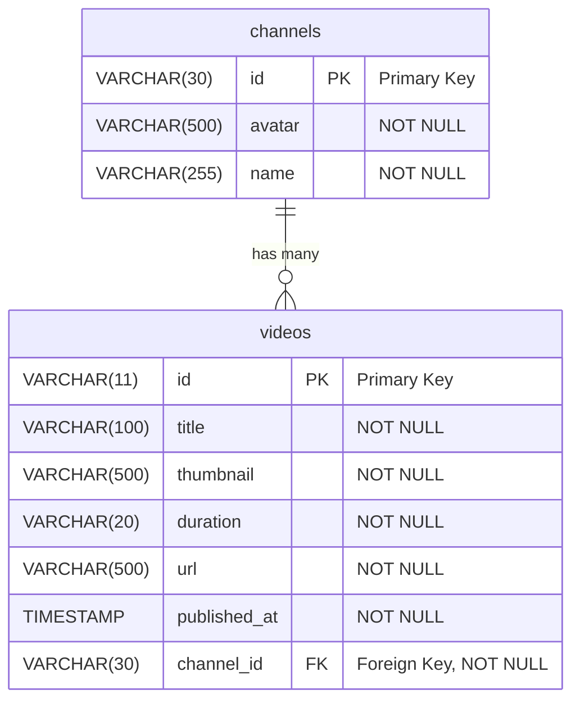

[faketube.app](https://faketube.app/)

In the previous episodes, we created a **solid frontend foundation** for our project - application shell and home page with a responsive UI and infinite scrolling.

But as we know, a YouTube clone without a **proper backend** is like a car without an engine — it looks good, but it won’t go anywhere.

We'll start building the **core backend services** for our project. Starting with a traditional approach with a **REST API** and **SQL database**, we will later move to a modern approach with a GraphQL based API and NoSQL database.

We'll leverage the power of AWS and **Infrastructure as Code (IoC)** with the **[AWS Cloud Development Kit (CDK)](https://aws.amazon.com/cdk/)** to **define and deploy** our **resources**.

So far our **high level architecture diagram** wasn't very impressive - we only used [AWS Amplify](https://aws.amazon.com/amplify/) service to [host](https://aws.amazon.com/amplify/hosting/) our web application. Of course there are many services under the hood like [Route 53](https://aws.amazon.com/route53/), [CloudFront](https://aws.amazon.com/cloudfront/), [Certificate Manager](https://aws.amazon.com/certificate-manager/), [Lambda](https://aws.amazon.com/lambda/) and [S3](https://aws.amazon.com/s3/), but Amplify provides level of abstraction, so that we don't have to think about it.  

In this episode we will add a few pieces. Think of it as creating a custom LEGO set for our backend, but this time, the LEGO bricks are **[Amazon API Gateway](https://aws.amazon.com/api-gateway/)**, **[AWS Lambda](https://aws.amazon.com/lambda/)**, and **[Amazon Aurora Serverless](https://aws.amazon.com/rds/aurora/serverless/)**.


On the frontend side we will use **[AWS Amplify for Next.js](https://docs.amplify.aws/gen1/nextjs/) library**, which will simplify **[fetching data](https://docs.amplify.aws/gen1/nextjs/build-a-backend/restapi/fetch-data/)** from the **API Gateway**.

This **sequence diagram** should give us a high level idea of the solution.


Let's get building!

## CDK (Cloud Development Kit)

The [Cloud Development Kit](https://aws.amazon.com/cdk/) is an open-source framework that lets you **define your cloud application resources** using **familiar programming languages**. Instead of writing complex JSON or YAML templates, you can use languages like **TypeScript**, Python, or Java to **define your infrastructure**.

### Install

To get started, you'll need to install the CDK CLI globally.

```
sudo npm install -g aws-cdk
```

We can verify installation by checking CDK version

```
cdk --version
2.1025.0 (build 409f8e7)
```

### Init

Let's create our AWS CDK CodeTube app. There is a quite good **[Tutorial: Create your first AWS CDK app](https://docs.aws.amazon.com/cdk/v2/guide/hello-world.html)** provided by AWS, so don't hesitate to check it out for more details.  

A CDK project should be in **its own directory**, with its own local module dependencies, so let's **create and navigate** to a `faketube` **directory**. 

```
mkdir faketube && cd faketube
```

Create CDK project using `cdk init` command, specifying `app` template and `typescript` language.

```
cdk init app --language typescript
```

Name of the app is derived from the parent directory we just created (`faketube`), so that's great, but we want to have **high level folder hierarchy** like

- web
- mobile
- cloud

so, let's rename that folder.

```
cd .. && mv faketube cloud && cd cloud
```

GitHub: [feat(home): cdk init app (#7)](https://github.com/JacekKosciesza/CodeTube/commit/6a17d162eb3ddde60998de97f3796f3405a14bf5)

### Stack

Our application, defined in `cloud/bin/faketube.ts` has a single stack, called `FaketubeStack` defined in `cloud/lib/faketube-stack.ts`.

Let's change it to a [PascalCase](https://wikipedia.org/wiki/PascalCase) naming convention and remove commented out example code, so that we have a clean, empty stack without any resource.

`cloud/bin/faketube.ts` _(diff)_

```diff
#!/usr/bin/env node
import * as cdk from "aws-cdk-lib";
-import { FaketubeStack } from "../lib/faketube-stack";
+import { FakeTubeStack } from "../lib/faketube-stack";

const app = new cdk.App();
-new FaketubeStack(app, "FaketubeStack", {
+new FakeTubeStack(app, "FakeTubeStack", {
```

`cloud/lib/faketube-stack.ts` _(diff)_

```diff
import * as cdk from 'aws-cdk-lib';
import { Construct } from 'constructs';
-// import * as sqs from 'aws-cdk-lib/aws-sqs';

-export class FaketubeStack extends cdk.Stack {
+export class FakeTubeStack extends cdk.Stack {
  constructor(scope: Construct, id: string, props?: cdk.StackProps) {
    super(scope, id, props);
-
-   // The code that defines your stack goes here
-
-    // example resource
-    // const queue = new sqs.Queue(this, 'FaketubeQueue', {
-    //   visibilityTimeout: cdk.Duration.seconds(300)
-    // });
  }
}
```

`cloud/lib/faketube-stack.ts`

```ts
import * as cdk from "aws-cdk-lib";
import { Construct } from "constructs";

export class FakeTubeStack extends cdk.Stack {
  constructor(scope: Construct, id: string, props?: cdk.StackProps) {
    super(scope, id, props);
  }
}
```

### Bootstrap

Before we deploy our stack, we will hve to run the `cdk bootstrap` command. This is a one-time operation per AWS account and region. It **creates a special Amazon S3 bucket** and an **AWS Identity and Access Management (IAM) role** that the **CDK uses to deploy** your resources.

```
cdk bootstrap
```

Simple Storage Service (S3)


Identity and Access Management (IAM)


### Diff

Before deploying any changes, it's a great practice to run `cdk diff`. This command compares your local code with the deployed stack and shows you a preview of the changes that will be made. It's like a safety check to **ensure you're not making any unintended modifications**.

```
cdk diff
```

Our stack is empty, so the result is not very interesting at the moment, but it will be when we define some resource.


### Deploy

Finally, to deploy your stack, you use the `cdk deploy` command. The CDK takes your code, **synthesizes it into a CloudFormation template**, and then **deploys that template** to your AWS account. This means **[CloudFormation](https://aws.amazon.com/cloudformation/) is the underlying engine** that actually provisions the resources, while CDK provides a much more intuitive and programmatic way to define them.

```
cdk deploy
```

CloudFormation


GitHub: [feat(home): rename cdk stack (#7)](https://github.com/JacekKosciesza/CodeTube/commit/4846b0ca56e271397c5e67719744f7be5368b0b3)

## Database

Now that we've prepared our backend project, it's time to **shift our focus to the database**. For this part of the project, we'll start with a traditional and well-understood approach using a **[relational database (RDB)](https://en.wikipedia.org/wiki/Relational_database)**. Our database of choice will be **[Amazon Aurora Serverless v2](https://aws.amazon.com/rds/aurora/serverless/)** with its **PostgreSQL-compatible edition**. This gives us a highly scalable and resilient database without the hassle of managing servers.

In a future article, we'll explore an **alternative approach** using a **NoSQL database** like **[DynamoDB](https://aws.amazon.com/dynamodb/)**. We'll **compare the database** modeling process, performance, and scalability to see how each solution fits different needs. For now, we'll stick with a relational model to establish a solid foundation for our data.

To begin, we'll first **define our database schema** using an **[Entity-Relationship Diagram (ERD)](https://mermaid.js.org/syntax/entityRelationshipDiagram.html)**. This will help us visualize the relationships between our data. Following this, we'll write the **[Data Definition Language (DDL)](https://en.wikipedia.org/wiki/Data_definition_language) SQL syntax** to create the structure of our database, specifically the `channels` and `videos` **tables**. 

With our tables in place, the next step is to **populate them**. We'll prepare **seed data** (based on our already defined mock data) to ensure that we can **fully test our new backend API**. This will give us a realistic dataset to work with.

Next step will be to use our **CDK project** to **create our Aurora Serverless v2 cluster and database in AWS**, ensuring our entire infrastructure is defined as code. 

Finally, we'll use the **[AWS CLI (Command Line Interface)](https://aws.amazon.com/cli/)** to **execute our SQL scripts**, setting up our database tables directly and populating them. This will complete the database portion of our backend and get us ready to connect our API.

### Schema

#### ERD (Entity Relationship Diagram)

First, let's define our **database schema** using a [Mermaid ERD (Entity Relationship Diagram)](https://mermaid.js.org/syntax/entityRelationshipDiagram.html). This will give us a clear **visual** of our `channels` and `videos` tables and how they **relate to each other**.

For our columns, we'll use a `VARCHAR` data type with an arbitrary **maximum length**. For instance, a YouTube video ID is always 11 characters long, so we'll define that specifically. For the other columns, we'll choose **reasonable default lengths** to get started.

`cloud/lib/aurora-erd.md`




It's worth noting a **small technical detail** I ran into: I initially tried to use the **[`INTERVAL` data type](https://neon.com/postgresql/postgresql-tutorial/postgresql-interval)** for the video `duration`, but it caused some **issues with the AWS CLI based queries**.

> An error occurred (UnsupportedResultException) when calling the ExecuteStatement operation: The result contains the **unsupported data type INTERVAL**.

I plan to revisit this in the future, as there might be a workaround like **adjusting the [`intervalstyle`](https://neon.com/postgresql/postgresql-tutorial/postgresql-interval#postgresql-interval-output-format)**. For now, we'll use a simpler data type to keep things moving.

####  DDL (Data Definition Language)

We define the database schema using DDL statements split into **separate files for each table**. This approach is necessary because the **`aws rds-data execute-statement` AWS CLI command** (which we will use later) **does not support multiple SQL statements in a single call**. As a result, attempting to run a single schema file containing multiple `CREATE TABLE` statements will produce a `ValidationException` error.

> An error occurred (ValidationException) when calling the ExecuteStatement operation: **Multistatements aren't supported**.

By splitting the schema definition, we can **execute each `CREATE TABLE` statement individually** and avoid this error. 

The `cloud/lib/channels.schema.sql` file defines the `channels` table:

```sql
CREATE TABLE channels (
    id VARCHAR(30) PRIMARY KEY,
    avatar VARCHAR(500) NOT NULL,
    name VARCHAR(255) NOT NULL    
);
```

The `cloud/lib/videos.schema.sql` file defines the `videos` table, including a foreign key constraint referencing the `channels` table:

```sql
CREATE TABLE videos (
    id VARCHAR(11) PRIMARY KEY,
    title VARCHAR(100) NOT NULL,    
    thumbnail VARCHAR(500) NOT NULL,
    duration VARCHAR(20) NOT NULL,
    url VARCHAR(500) NOT NULL,
    published_at TIMESTAMP WITH TIME ZONE NOT NULL,    
    channel_id VARCHAR(30) NOT NULL,
        
    CONSTRAINT fk_videos_channel_id 
        FOREIGN KEY (channel_id) 
        REFERENCES channels(id) 
        ON DELETE CASCADE
);
```

GitHub: [feat(home): database schema (#7)](https://github.com/JacekKosciesza/CodeTube/commit/9f1ae351a37ac0d244619e14c25a6cc75fedb1ca)

### Seed

To **populate our database** with initial data for testing, we will use **SQL based seed files**. Similar to the DDL section, we split the seed data into **separate files for each table**.

The `cloud/lib/channels.seed.sql` file inserts the initial data for the `channels` table:

```sql
INSERT INTO channels (id, avatar, name) VALUES
('AmazonNovaReel', '/channels/AmazonNovaReel/AmazonNovaReel.png', 'Amazon Nova Reel');
```

The `cloud/lib/videos.seed.sql` file inserts the data for the `videos` table:

```sql
INSERT INTO videos (id, title, thumbnail, duration, url, published_at, channel_id) VALUES
('q9Gm7a6Wwjk', 'The Amazing World of Octopus!', '/videos/q9Gm7a6Wwjk/q9Gm7a6Wwjk.png', 'PT0M6.214542S', '/videos/q9Gm7a6Wwjk/q9Gm7a6Wwjk.mp4', '2025-03-03T15:58:23Z', 'AmazonNovaReel'),
('QYUGZ3ueoHQ', 'Magic Wheels: The Future of Cars', '/videos/QYUGZ3ueoHQ/QYUGZ3ueoHQ.png', 'PT0M6.047708S', '/videos/QYUGZ3ueoHQ/QYUGZ3ueoHQ.mp4', '2025-03-03T14:22:54Z', 'AmazonNovaReel'),
('SkrDa20qGGo', 'Dancing Pets: A Fun Animal Show', '/videos/SkrDa20qGGo/SkrDa20qGGo.png', 'PT0M6.047708S', '/videos/SkrDa20qGGo/SkrDa20qGGo.mp4', '2025-03-04T15:13:16Z', 'AmazonNovaReel'),
('snI0xHnk9vw', 'Learning with Fun: The Magic of Numbers', '/videos/snI0xHnk9vw/snI0xHnk9vw.png', 'PT0M6.047708S', '/videos/snI0xHnk9vw/snI0xHnk9vw.mp4', '2025-03-04T15:53:08Z', 'AmazonNovaReel'),
('tO-6SL2drHA', 'Learning with Fun: The Magic of Science', '/videos/tO-6SL2drHA/tO-6SL2drHA.png', 'PT0M6.047708S', '/videos/tO-6SL2drHA/tO-6SL2drHA.mp4', '2025-03-04T16:10:52Z', 'AmazonNovaReel'),
('51KK6cQwqdo', 'Desert Motorcycle Adventure', '/videos/51KK6cQwqdo/51KK6cQwqdo.png', 'PT0M6.047708S', '/videos/51KK6cQwqdo/51KK6cQwqdo.mp4', '2025-03-04T16:37:57Z', 'AmazonNovaReel'),
('6Pz1MlphyvA', 'Amazing Soccer Tricks', '/videos/6Pz1MlphyvA/6Pz1MlphyvA.png', 'PT0M6.047708S', '/videos/6Pz1MlphyvA/6Pz1MlphyvA.mp4', '2025-03-04T16:54:19Z', 'AmazonNovaReel'),
('rX4LkHQLKSw', 'Tennis Magic: The Spin of Champions', '/videos/rX4LkHQLKSw/rX4LkHQLKSw.png', 'PT0M6.047708S', '/videos/rX4LkHQLKSw/rX4LkHQLKSw.mp4', '2025-03-04T17:12:16Z', 'AmazonNovaReel'),
('mYiQU9_bvAA', 'Mud Monster Truck Adventure', '/videos/mYiQU9_bvAA/mYiQU9_bvAA.png', 'PT0M6.047708S', '/videos/mYiQU9_bvAA/mYiQU9_bvAA.mp4', '2025-03-05T15:47:29Z', 'AmazonNovaReel'),
('1ccSDKMvpGA', 'Exploring the Magic of Motorhomes', '/videos/1ccSDKMvpGA/1ccSDKMvpGA.png', 'PT0M6.047708S', '/videos/1ccSDKMvpGA/1ccSDKMvpGA.mp4', '2025-03-05T16:01:54Z', 'AmazonNovaReel'),
('8ibeIVJKsYQ', 'Rocket Science: Blast Off!', '/videos/8ibeIVJKsYQ/8ibeIVJKsYQ.png', 'PT0M6.047708S', '/videos/8ibeIVJKsYQ/8ibeIVJKsYQ.mp4', '2025-03-05T16:20:43Z', 'AmazonNovaReel'),
('PcxHBLxkNuA', 'The Magic of Magnets', '/videos/PcxHBLxkNuA/PcxHBLxkNuA.png', 'PT0M6.047708S', '/videos/PcxHBLxkNuA/PcxHBLxkNuA.mp4', '2025-03-05T16:30:52Z', 'AmazonNovaReel'),
('j5az8g8QEZ4', 'Snail''s Slow and Steady Adventure', '/videos/j5az8g8QEZ4/j5az8g8QEZ4.png', 'PT0M6.047708S', '/videos/j5az8g8QEZ4/j5az8g8QEZ4.mp4', '2025-03-05T16:44:19Z', 'AmazonNovaReel'),
('j4aY8zGqcLQ', 'Rattlesnake''s Dance: A Wild Adventure', '/videos/j4aY8zGqcLQ/j4aY8zGqcLQ.png', 'PT0M6.047708S', '/videos/j4aY8zGqcLQ/j4aY8zGqcLQ.mp4', '2025-03-05T16:56:10Z', 'AmazonNovaReel'),
('ZG5ixKK6ABs', 'Classic Golf: The Art of the Swing', '/videos/ZG5ixKK6ABs/ZG5ixKK6ABs.png', 'PT0M6.047708S', '/videos/ZG5ixKK6ABs/ZG5ixKK6ABs.mp4', '2025-03-05T17:18:03Z', 'AmazonNovaReel'),
('cJanxpcCwq0', 'Retro Hockey: A Blast from the Past', '/videos/cJanxpcCwq0/cJanxpcCwq0.png', 'PT0M6.047708S', '/videos/cJanxpcCwq0/cJanxpcCwq0.mp4', '2025-03-05T17:34:12Z', 'AmazonNovaReel'),
('7qgegT-6tq8', 'Exploring Magical Festivals', '/videos/7qgegT-6tq8/7qgegT-6tq8.png', 'PT0M6.047708S', '/videos/7qgegT-6tq8/7qgegT-6tq8.mp4', '2025-03-06T15:15:29Z', 'AmazonNovaReel'),
('wCYxsFwXVAk', 'Adventure Awaits: Mountain Hiking', '/videos/wCYxsFwXVAk/wCYxsFwXVAk.png', 'PT0M6.047708S', '/videos/wCYxsFwXVAk/wCYxsFwXVAk.mp4', '2025-03-06T15:30:21Z', 'AmazonNovaReel'),
('aD5_u3q6KUM', 'City Adventure: Walking Tour', '/videos/aD5_u3q6KUM/aD5_u3q6KUM.png', 'PT0M6.047708S', '/videos/aD5_u3q6KUM/aD5_u3q6KUM.mp4', '2025-03-06T15:52:52Z', 'AmazonNovaReel'),
('aFwvWFVIUww', 'Live from the Big Conference!', '/videos/aFwvWFVIUww/aFwvWFVIUww.png', 'PT0M6.047708S', '/videos/aFwvWFVIUww/aFwvWFVIUww.mp4', '2025-03-06T16:06:33Z', 'AmazonNovaReel'),
('zGl4juMoUow', 'RTS Battle: Strategy in Action', '/videos/zGl4juMoUow/zGl4juMoUow.png', 'PT0M6.047708S', '/videos/zGl4juMoUow/zGl4juMoUow.mp4', '2025-03-06T16:20:51Z', 'AmazonNovaReel'),
('cCps60RZP4g', 'Retro Platformer Adventure', '/videos/cCps60RZP4g/cCps60RZP4g.png', 'PT0M6.047708S', '/videos/cCps60RZP4g/cCps60RZP4g.mp4', '2025-03-06T16:34:34Z', 'AmazonNovaReel'),
('LvQMMXWXOvE', 'Chess Showdown: The Ultimate Battle', '/videos/LvQMMXWXOvE/LvQMMXWXOvE.png', 'PT0M6.047708S', '/videos/LvQMMXWXOvE/LvQMMXWXOvE.mp4', '2025-03-06T16:54:22Z', 'AmazonNovaReel'),
('z-dBt8MpAnA', 'Chess Showdown: The Ultimate Battle', '/videos/z-dBt8MpAnA/z-dBt8MpAnA.png', 'PT0M6.047708S', '/videos/z-dBt8MpAnA/z-dBt8MpAnA.mp4', '2025-03-06T17:16:39Z', 'AmazonNovaReel'),
('k1DF_Rcan6M', 'Standing Up for Change: Peaceful Road Block', '/videos/k1DF_Rcan6M/k1DF_Rcan6M.png', 'PT0M6.047708S', '/videos/k1DF_Rcan6M/k1DF_Rcan6M.mp4', '2025-03-07T14:05:46Z', 'AmazonNovaReel'),
('SJOCLMEuoh0', 'Tree Guardians: Protecting Nature''s Champions', '/videos/SJOCLMEuoh0/SJOCLMEuoh0.png', 'PT0M6.047708S', '/videos/SJOCLMEuoh0/SJOCLMEuoh0.mp4', '2025-03-07T14:20:26Z', 'AmazonNovaReel'),
('M8V1FcKde2g', 'Street Volunteers: Collecting for a Cause', '/videos/M8V1FcKde2g/M8V1FcKde2g.png', 'PT0M6.047708S', '/videos/M8V1FcKde2g/M8V1FcKde2g.mp4', '2025-03-07T14:36:03Z', 'AmazonNovaReel'),
('saYIayqn6I0', 'Charity Run: Running Together for a Cause', '/videos/saYIayqn6I0/saYIayqn6I0.png', 'PT0M6.047708S', '/videos/saYIayqn6I0/saYIayqn6I0.mp4', '2025-03-07T14:48:26Z', 'AmazonNovaReel'),
('NzB9W_14tgE', 'Hair Magic: A Girl''s New Haircut', '/videos/NzB9W_14tgE/NzB9W_14tgE.png', 'PT0M6.047708S', '/videos/NzB9W_14tgE/NzB9W_14tgE.mp4', '2025-03-07T15:01:18Z', 'AmazonNovaReel'),
('RQmLNnELeFQ', 'Fashion Forward: Catwalk Chic', '/videos/RQmLNnELeFQ/RQmLNnELeFQ.png', 'PT0M6.047708S', '/videos/RQmLNnELeFQ/RQmLNnELeFQ.mp4', '2025-03-07T15:13:21Z', 'AmazonNovaReel'),
('8tS7B-c0b_8', 'Easy Soup Cooking Fun', '/videos/8tS7B-c0b_8/8tS7B-c0b_8.png', 'PT0M6.047708S', '/videos/8tS7B-c0b_8/8tS7B-c0b_8.mp4', '2025-03-07T15:42:59Z', 'AmazonNovaReel'),
('EoptO2hf3tY', 'How to Use a Yo Yo: Fun Tricks for Beginners', '/videos/EoptO2hf3tY/EoptO2hf3tY.png', 'PT0M6.047708S', '/videos/EoptO2hf3tY/EoptO2hf3tY.mp4', '2025-03-07T16:08:48Z', 'AmazonNovaReel');
```

GitHub: [feat(home): database seed (#7)](https://github.com/JacekKosciesza/CodeTube/commit/2cac644a5ef3b914d6af87b947cf6882a8fcd21f)

### Aurora

The **database is a core component** of our backend, and for this project, we're using **[Amazon Aurora Serverless v2](https://aws.amazon.com/rds/aurora/serverless/)**. It's a version of Amazon's **cloud-native relational database** service that **automatically scales capacity up and down**. The one we're using is a **PostgreSQL-compatible edition**, meaning it works just like a standard PostgreSQL database, but with the added benefits of Aurora's **high performance and scalability**. To set all of this up, we'll use the **[Amazon Relational Database Service Construct Library](https://docs.aws.amazon.com/cdk/api/v2/docs/aws-cdk-lib.aws_rds-readme.html#amazon-relational-database-service-construct-library)**. 

`cloud/lib/aurora.ts`

```ts
import { Construct } from "constructs";
import * as cdk from "aws-cdk-lib";
import * as ec2 from "aws-cdk-lib/aws-ec2";
import * as rds from "aws-cdk-lib/aws-rds";
import * as secretsmanager from "aws-cdk-lib/aws-secretsmanager";

import { VPC } from "./vpc";

interface Props {
  vpc: VPC;
}

export class Aurora extends Construct {
  public readonly defaultName = "faketube";
  public readonly cluster: rds.DatabaseCluster;

  public get credentials(): secretsmanager.Secret {
    return this.cluster.node.children.filter(
      (child) => child instanceof rds.DatabaseSecret
    )[0] as rds.DatabaseSecret;
  }

  constructor(scope: Construct, id: string, { vpc }: Props) {
    super(scope, id);

    this.cluster = new rds.DatabaseCluster(this, "rds-database-cluster", {
      clusterIdentifier: this.defaultName,
      defaultDatabaseName: this.defaultName,
      engine: rds.DatabaseClusterEngine.auroraPostgres({
        version: rds.AuroraPostgresEngineVersion.VER_16_6,
      }),
      enableDataApi: true,
      vpc: vpc.vpc,
      vpcSubnets: {
        subnetType: ec2.SubnetType.PRIVATE_ISOLATED,
      },
      removalPolicy: cdk.RemovalPolicy.DESTROY,
      writer: rds.ClusterInstance.serverlessV2("writer"),
      readers: [rds.ClusterInstance.serverlessV2("reader1")],
      serverlessV2MinCapacity: 0,
      serverlessV2MaxCapacity: 1,
      serverlessV2AutoPauseDuration: cdk.Duration.hours(0.5),
    });

    new cdk.CfnOutput(this, "AuroraClusterArn", {
      value: this.cluster.clusterArn,
    });

    new cdk.CfnOutput(this, "AuroraClusterSecretArn", {
      value: this.credentials.secretArn,
    });
  }
}
```

Let's look at some key properties and a few things about the code itself:

**public get credentials()**
It's a getter method which will give us credentials to our database cluster. We will need this later in the `Lambda` function which will query our database.

**engine**
This is where we specify the database engine. We're going with `auroraPostgres` and `version 16.6`, which gives us a PostgreSQL-compatible Aurora database.

**enableDataApi** 
Enabling the Data API allows our applications to communicate with the database over HTTP, which is super helpful for serverless architectures like ours. No need to manage those pesky long-lived database connections!

**removalPolicy**
When we decide to tear down our CDK stack, this parameter tells AWS to also delete the database cluster and all its data. So it's perfect our experiments, but for the production environment we will have to change it to `SNAPSHOT` or `RETAIN`.

**serverlessV2MinCapacity**
**serverlessV2MaxCapacity**
**serverlessV2AutoPauseDuration**
These three properties work together to define the scaling behavior of the Aurora Serverless v2 cluster. `Min/Max Capacity` define the lower and upper bounds for the database's capacity, allowing it to automatically scale up to handle peak loads and scale down to save costs. We set `Min Capacity` to 0, which means that it will scale down to a complete idle state when there are no active connections or queries for `Auto Pause Duration`.

**vpc**
**vpcSubnets**
> You **must always launch a database in a VPC**. Use the vpcSubnets attribute to control whether your instances will be launched privately or publicly

Without it we will get this error during deployment:

> ValidationError: Provide either vpc or instanceProps.vpc, but not both

So, let's define it.

### VPC

We will use a very basic [VPC (Virtual Private Cloud)](https://aws.amazon.com/vpc/), which is a logically isolated virtual network. Subnet type will be `PRIVATE_ISOLATED`, which

> do not route from or to the Internet, and as such do not require NAT gateways. They can only connect to or be connected to from other instances in the same VPC

`cloud/lib/vpc.ts`

```ts
import { Construct } from "constructs";
import * as ec2 from "aws-cdk-lib/aws-ec2";

export class VPC extends Construct {
  public readonly vpc: ec2.Vpc;

  constructor(scope: Construct, id: string) {
    super(scope, id);

    this.vpc = new ec2.Vpc(this, "vpc", {
      vpcName: "sitetube",
      createInternetGateway: false,
      subnetConfiguration: [
        {
          name: "aurora",
          subnetType: ec2.SubnetType.PRIVATE_ISOLATED,
          cidrMask: 24,
        },
      ],
    });
  }
}
```

### Stack

Now, let's **deploy the stack**. We'll do this in **two distinct steps** to give us better control and visibility over the resources being created. First, we'll deploy our `VPC`, and then in the second step, we'll deploy the `Aurora` database cluster.

#### VPC

`cloud/lib/faketube-stack.ts` _(diff)_

```diff
import * as cdk from 'aws-cdk-lib';
import { Construct } from 'constructs';
+
+import { VPC } from "./vpc";

export class FakeTubeStack extends cdk.Stack {
  constructor(scope: Construct, id: string, props?: cdk.StackProps) {
    super(scope, id, props);
+
+    new VPC(this, "vpc");
  }
}
```

`cloud/lib/faketube-stack.ts`

```ts
import * as cdk from "aws-cdk-lib";
import { Construct } from "constructs";

import { VPC } from "./vpc";

export class FakeTubeStack extends cdk.Stack {
  constructor(scope: Construct, id: string, props?: cdk.StackProps) {
    super(scope, id, props);

    new VPC(this, "vpc");
  }
}
```

```
cdk diff
```


```
cdk deploy
```


### Aurora

`cloud/lib/faketube-stack.ts` _(diff)_

```diff
import * as cdk from "aws-cdk-lib";
import { Construct } from "constructs";

+import { Aurora } from "./aurora";
import { VPC } from "./vpc";

export class FakeTubeStack extends cdk.Stack {
  constructor(scope: Construct, id: string, props?: cdk.StackProps) {
    super(scope, id, props);

-   new VPC(this, "vpc");
+   const vpc = new VPC(this, "vpc");
+   new Aurora(this, "aurora", { vpc });
  }
}
```

`cloud/lib/faketube-stack.ts`

```ts
import * as cdk from "aws-cdk-lib";
import { Construct } from "constructs";

import { Aurora } from "./aurora";
import { VPC } from "./vpc";

export class FakeTubeStack extends cdk.Stack {
  constructor(scope: Construct, id: string, props?: cdk.StackProps) {
    super(scope, id, props);

    const vpc = new VPC(this, "vpc");
    new Aurora(this, "aurora", { vpc });
  }
}
```

```
cdk diff
```


```
cdk deploy
```


During the CDK deployment we got this warning.

> [Warning at /CodeTubeStack/aurora/rds-database-cluster] Cluster rds-database-cluster only has serverless readers and no reader is in promotion tier 0-1.Serverless readers in promotion tiers >= 2 **will NOT scale with the writer**, which can lead to **availability issues if a failover event occurs**. It is **recommended that at least one reader has `scaleWithWriter` set to true** [ack: @aws-cdk/aws-rds:noFailoverServerlessReaders]

[Choosing the minimum Aurora Serverless v2 capacity setting for a cluster](https://docs.aws.amazon.com/AmazonRDS/latest/AuroraUserGuide/aurora-serverless-v2.setting-capacity.html#aurora-serverless-v2-examples-setting-capacity-range-for-cluster), gives some more context to that

> If you have a DB cluster with Aurora Serverless v2 reader DB instances, the readers don't scale along with the writer DB instance when the promotion tier of the readers isn't 0 or 1. In that case, setting a low minimum capacity can result in excessive replication lag. That's because the readers might not have enough capacity to apply changes from the writer when the database is busy. We recommend that you set the minimum capacity to a value that represents a comparable amount of memory and CPU to the writer DB instance

As at the moment we are using our database only for reading data, we will **ignore this issue for now**, but we will come back to that later.

### SQL

With our database now ready, the next step is to **put our SQL scripts to work**. We’ll use the **AWS Command Line Interface (CLI)** to **execute our schema definitions and then seed the database with initial data**. After these commands are run, we'll verify that everything is working correctly by sending a **test query**.

#### Outputs

With the infrastructure successfully deployed, the AWS Cloud Development Kit (CDK) provides us with **key outputs from our stack**. We'll use these values to **define environment variables** for subsequent AWS CLI commands. 

```
✅  FakeTubeStack

✨  Deployment time: 25.05s

Outputs:
FakeTubeStack.auroraRdsArn4D18277C = arn:aws:rds:eu-west-1:091167074253:cluster:faketube
FakeTubeStack.auroraRdsSecretArnB6A3C5A0 = arn:aws:secretsmanager:eu-west-1:091167074253:secret:aurorardsdatabaseclusterSec-AD0YMbY5cBGY-tqs2K5
```

```
export FAKETUBE_AWS_AURORA_CLUSTER_ARN=arn:aws:rds:eu-west-1:091167074253:cluster:faketube
export FAKETUBE_AWS_AURORA_CLUSTER_SECRET_ARN=arn:aws:secretsmanager:eu-west-1:091167074253:secret:aurorardsdatabaseclusterSec-AD0YMbY5cBGY-tqs2K5
export FAKETUBE_AWS_AURORA_DATABASE_NAME=faketube
```

#### Schema

We can finally **execute our Data Definition Language (DDL) scripts** to create the database schema. When executing SQL statements using AWS CLI, we may encounter this error:

> An error occurred (DatabaseResumingException) when calling the ExecuteStatement operation: The Aurora DB instance db-AQPANXFFWTE7LBPLXB63OKB3A4 is **resuming after being auto-paused**. **Please wait a few seconds and try again**.

It's self explanatory, just wait a few seconds for the database to resume.

##### Channels

```
aws rds-data execute-statement \
    --resource-arn $FAKETUBE_AWS_AURORA_CLUSTER_ARN \
    --secret-arn $FAKETUBE_AWS_AURORA_CLUSTER_SECRET_ARN \
    --database $FAKETUBE_AWS_AURORA_DATABASE_NAME \
    --sql "$(cat ./lib/channels.schema.sql)"
```

Result:

```json
{
    "numberOfRecordsUpdated": 0,
    "generatedFields": []
}
```

##### Videos

```
aws rds-data execute-statement \
    --resource-arn $FAKETUBE_AWS_AURORA_CLUSTER_ARN \
    --secret-arn $FAKETUBE_AWS_AURORA_CLUSTER_SECRET_ARN \
    --database $FAKETUBE_AWS_AURORA_DATABASE_NAME \
    --sql "$(cat ./lib/videos.schema.sql)"
```

Result:

```json
{
    "numberOfRecordsUpdated": 0,
    "generatedFields": []
}
```

#### Seed

Now that we've defined the database schema, the next step is to **execute our seed statements** to **populate database** with the initial data.

##### Channels

```
aws rds-data execute-statement \
    --resource-arn $FAKETUBE_AWS_AURORA_CLUSTER_ARN \
    --secret-arn $FAKETUBE_AWS_AURORA_CLUSTER_SECRET_ARN \
    --database $FAKETUBE_AWS_AURORA_DATABASE_NAME \
    --sql "$(cat ./lib/channels.seed.sql)"
```

Result:


```json
{
    "numberOfRecordsUpdated": 1,
    "generatedFields": []
}
```

##### Videos

```
aws rds-data execute-statement \
    --resource-arn $FAKETUBE_AWS_AURORA_CLUSTER_ARN \
    --secret-arn $FAKETUBE_AWS_AURORA_CLUSTER_SECRET_ARN \
    --database $FAKETUBE_AWS_AURORA_DATABASE_NAME \
    --sql "$(cat ./lib/videos.seed.sql)"
```

Result:

```json
{
    "numberOfRecordsUpdated": 32,
    "generatedFields": []
}
```

#### Query

To check that our schema and seed data were correctly deployed, we'll **run a verification query**. This test confirms the **tables exist** and **contain the expected data**, ensuring our database is ready to be used by the application.

`lib/videos.query.sql`

```sql
SELECT 
    v.*,
    c.name as channel_name,
    c.avatar as channel_avatar
FROM videos v
INNER JOIN channels c ON v.channel_id = c.id
ORDER BY v.published_at ASC
LIMIT 24 OFFSET 0;
```

```
aws rds-data execute-statement \
    --resource-arn $FAKETUBE_AWS_AURORA_CLUSTER_ARN \
    --secret-arn $FAKETUBE_AWS_AURORA_CLUSTER_SECRET_ARN \
    --database $FAKETUBE_AWS_AURORA_DATABASE_NAME \
    --sql "$(cat ./lib/videos.query.sql)"
```

Result:

```json
{
    "records": [
        [
            {
                "stringValue": "QYUGZ3ueoHQ"
            },
            {
                "stringValue": "Magic Wheels: The Future of Cars"
            },
            {
                "stringValue": "/videos/QYUGZ3ueoHQ/QYUGZ3ueoHQ.png"
            },
            {
                "stringValue": "PT0M6.047708S"
            },
            {
                "stringValue": "/videos/QYUGZ3ueoHQ/QYUGZ3ueoHQ.mp4"
            },
            {
                "stringValue": "2025-03-03 14:22:54"
            },
            {
                "stringValue": "AmazonNovaReel"
            },
            {
                "stringValue": "Amazon Nova Reel"
            },
            {
                "stringValue": "/channels/AmazonNovaReel/AmazonNovaReel.png"
            }
        ],
        [
            {
                "stringValue": "q9Gm7a6Wwjk"
            },
            {
                "stringValue": "The Amazing World of Octopus!"
            },
            {
                "stringValue": "/videos/q9Gm7a6Wwjk/q9Gm7a6Wwjk.png"
...
```

GitHub: [feat(home): aurora (#7)](https://github.com/JacekKosciesza/CodeTube/commit/c05978165cebfe731dcc5838e6e5cbb124d580e0)

## API

An **API (Application Programming Interface)** acts as a crucial **bridge**, allowing our web application to **communicate with and access our backend services** hosted on AWS. We will **define this API using [OpenAPI](https://www.openapis.org/)**, a standardized way to describe RESTful APIs.

For this project, we will use **[Amazon API Gateway](https://aws.amazon.com/api-gateway/) to create our API**, focusing on both the **[HTTP and REST variants](https://docs.aws.amazon.com/apigateway/latest/developerguide/http-api-vs-rest.html)**. While HTTP APIs are a simpler, faster, and more cost-effective option for building stateless APIs, REST APIs offer more features and control, such as API keys, request validation and AWS WAF integration.

Although you can use an **OpenAPI definition to directly create an API Gateway**:
- [Use OpenAPI definitions for HTTP APIs in API Gateway](https://docs.aws.amazon.com/apigateway/latest/developerguide/http-api-open-api.html)
- [Develop REST APIs using OpenAPI in API Gateway](https://docs.aws.amazon.com/apigateway/latest/developerguide/api-gateway-import-api.html)

we will not go that route this time.

Similarly, while there are ways to **directly integrate** API Gateway with other AWS services, we will instead use an **[AWS Lambda](https://aws.amazon.com/lambda/) function as our backend**.

To enhance our Lambda function, we'll leverage the **[Middy](https://middy.js.org/)** - Node.js **middleware engine** for AWS Lambda, which allows you to

> Organise your Lambda code, remove code duplication, focus on business logic!

We'll also incorporate **[Powertools for AWS](https://powertools.aws.dev/)**, a powerful developer toolkit designed to accelerate the adoption of **serverless best practices**. Our focus will be on leveraging its core features, including **logging**, **tracing**, and **metrics**, to enhance the visibility and operational health of our application.

Finally, to ensure our API functions correctly, we will **test the entire setup using [cURL](https://curl.se/)**, a powerful command-line tool for transferring data.

### Schema

When building an API, it's essential to have a **clear contract** that defines **how clients can interact** with it. This is where the **schema** comes in. We are going to use [OpenAPI](https://www.openapis.org/) (formerly [Swagger](https://swagger.io/)) to define our API's structure in a YAML file.

While OpenAPI can be used for many things, like **automatically generating client libraries** and **server stubs**, for now, we will use it to achieve two main goals: to have a **clear definition of what we are building** and to **test our API from the [Swagger Editor](https://editor.swagger.io/)**. This approach helps us ensure consistency and provides a single source of truth for our API's structure.

Let's put our OpenAPI definition in the `home` feature folder.

`cloud/lib/home/home.openapi.yaml`

```yaml
openapi: 3.0.3
info:
  title: FakeTube Home API
  version: 0.1.0
paths:
  /videos:
    get:
      summary: Retrieve a paginated list of videos
      parameters:
        - name: page
          in: query
          schema:
            type: integer
            default: 0
        - name: pageSize
          in: query
          schema:
            type: integer
            default: 24
      responses:
        "200":
          description: The requested page of videos
          content:
            application/json:
              schema:
                $ref: "#/components/schemas/Page"
        "400":
          description: Bad request.
        "500":
          description: Server error.
components:
  schemas:
    Page:
      type: object
      properties:
        items:
          type: array
          items:
            $ref: "#/components/schemas/Video"
        currentPage:
          type: integer
        hasNextPage:
          type: boolean
      example:
        items:
          - id: "q9Gm7a6Wwjk"
            title: "The Amazing World of Octopus!"
            thumbnail: "/videos/q9Gm7a6Wwjk/q9Gm7a6Wwjk.png"
            duration: "PT0M6.214542S"
            url: "/videos/q9Gm7a6Wwjk/q9Gm7a6Wwjk.mp4"
            publishedAt: "2025-03-03T15:58:23Z"
            channel:
              id: "AmazonNovaReel"
              avatar: "/channels/AmazonNovaReel/AmazonNovaReel.png"
              name: "Amazon Nova Reel"
        currentPage: 0
        hasNextPage: true
    Video:
      type: object
      properties:
        id:
          type: string
        title:
          type: string
        url:
          type: string
          format: uri
        channel:
          $ref: "#/components/schemas/Channel"
        thumbnail:
          type: string
          format: uri
        duration:
          type: string
          format: duration
        publishedAt:
          type: string
          format: date-time
      example:
        id: "q9Gm7a6Wwjk"
        title: "The Amazing World of Octopus!"
        thumbnail: "/videos/q9Gm7a6Wwjk/q9Gm7a6Wwjk.png"
        duration: "PT0M6.214542S"
        url: "/videos/q9Gm7a6Wwjk/q9Gm7a6Wwjk.mp4"
        publishedAt: "2025-03-03T15:58:23Z"
        channel:
          id: "AmazonNovaReel"
          avatar: "/channels/AmazonNovaReel/AmazonNovaReel.png"
          name: "Amazon Nova Reel"
    Channel:
      type: object
      properties:
        id:
          type: string
        name:
          type: string
        avatar:
          type: string
          format: uri
      example:
        id: "AmazonNovaReel"
        avatar: "/channels/AmazonNovaReel/AmazonNovaReel.png"
        name: "Amazon Nova Reel"
```

To visualize this contract, you can simply **copy and paste** the content of our `home.openapi.yaml` file into the online [Swagger Editor](https://editor.swagger.io/). The editor will instantly **render an interactive**, beautiful **documentation page** for the API.


GitHub: [feat(home): openapi schema (#7)](https://github.com/JacekKosciesza/CodeTube/commit/25faadec0bc06ab7d7d8121dca0d51b0a53e7cfb)

### API Gateway

We will now focus on the **[API Gateway](https://aws.amazon.com/api-gateway/)**, a core AWS service for **creating and managing APIs**. Just like before, our implementation will leverage the **higher level [AWS CDK Constructs](https://docs.aws.amazon.com/cdk/v2/guide/constructs.html)**, enabling us to easily define our API infrastructure programmatically.

This section will cover creating both **[REST](https://docs.aws.amazon.com/cdk/api/v2/docs/aws-cdk-lib.aws_apigateway-readme.html)** and **[HTTP](https://docs.aws.amazon.com/cdk/api/v2/docs/aws-cdk-lib.aws_apigatewayv2-readme.html) API versions**, demonstrating their respective configurations.

We'll also cover crucial details like **[CORS](https://developer.mozilla.org/en-US/docs/Web/HTTP/Guides/CORS)**, showing how it's configured within our code, and how the **stack outputs** are used to export the final **API gateway URLs** for easy access.

#### REST API

Let's start with the **REST API** version.

`cloud/lib/gateway.ts`

```ts
import * as apigw from "aws-cdk-lib/aws-apigateway";
import * as cdk from "aws-cdk-lib";
import { Construct } from "constructs";

export class Gateway extends Construct {
  public rest: apigw.RestApi;

  constructor(scope: Construct, id: string) {
    super(scope, id);

    this.rest = new apigw.RestApi(this, "faketubeRest", {
      defaultCorsPreflightOptions: {
        allowHeaders: apigw.Cors.DEFAULT_HEADERS,
        allowMethods: ["GET", "OPTIONS"],
        allowOrigins: this.node.tryGetContext("corsOrigins") || [],
      },
    });

    new cdk.CfnOutput(this, "ApiGatewayRestUrlExport", {
      value: this.rest.url,
    });
  }
}
```
When we configure the `defaultCorsPreflightOptions` property, notice how we retrieve `allowOrigins` from the [CDK context](https://docs.aws.amazon.com/cdk/v2/guide/context.html). This is a powerful feature that allows us to configure our API's behavior without changing the code itself.

**Context values** are a way to pass **configuration settings**, such as `corsOrigins`, into our CDK application from an **external source like `cdk.json`**. This makes our infrastructure flexible and reusable for different environments.

`cloud/cdk.json` _(diff)_

```diff
{
  "app": "npx ts-node --prefer-ts-exts bin/faketube.ts",
  "watch": {
    "include": ["**"],
    "exclude": [
      "README.md",
      "cdk*.json",
      "**/*.d.ts",
      "**/*.js",
      "tsconfig.json",
      "package*.json",
      "yarn.lock",
      "node_modules",
      "test"
    ]
  },
  "context": {
+   "corsOrigins": ["http://localhost:3000", "https://faketube.app"],
    "@aws-cdk/aws-lambda:recognizeLayerVersion": true,
```

We specifically set the **CORS origins** to `0 and `https://faketube.app` to allow our frontend application (on development and production environments) to make **requests to the API**. The browser's same-origin policy **would otherwise block** these requests.

#### HTTP API

Now let's write the corresponding infrastructure code for the **HTTP API** version.

`cloud/lib/gateway.ts` _(diff)_

```diff
import * as apigw from "aws-cdk-lib/aws-apigateway";
+import * as apigwv2 from "aws-cdk-lib/aws-apigatewayv2";
import * as cdk from "aws-cdk-lib";
import { Construct } from "constructs";

export class Gateway extends Construct {
  public rest: apigw.RestApi;
+ public http: apigwv2.HttpApi;

  constructor(scope: Construct, id: string) {
    super(scope, id);

    this.rest = new apigw.RestApi(this, "faketubeRest", {
      defaultCorsPreflightOptions: {
        allowHeaders: apigw.Cors.DEFAULT_HEADERS,
        allowMethods: ["GET", "OPTIONS"],
        allowOrigins: this.node.tryGetContext("corsOrigins") || [],
      },
    });

    new cdk.CfnOutput(this, "ApiGatewayRestUrlExport", {
      value: this.rest.url,
    });
+
+   this.http = new apigwv2.HttpApi(this, "faketubeHttp", {
+     corsPreflight: {
+       allowMethods: [
+         apigwv2.CorsHttpMethod.GET,
+         apigwv2.CorsHttpMethod.OPTIONS,
+       ],
+       allowOrigins: this.node.tryGetContext("corsOrigins") || [],
+     },
+   });
+
+   new cdk.CfnOutput(this, "ApiGatewayHttpUrlExport", {
+     value: this.http.url!,
+   });
  }
}
```

```ts
import * as apigw from "aws-cdk-lib/aws-apigateway";
import * as apigwv2 from "aws-cdk-lib/aws-apigatewayv2";
import * as cdk from "aws-cdk-lib";
import { Construct } from "constructs";

export class Gateway extends Construct {
  public rest: apigw.RestApi;
  public http: apigwv2.HttpApi;

  constructor(scope: Construct, id: string) {
    super(scope, id);

    this.rest = new apigw.RestApi(this, "faketubeRest", {
      defaultCorsPreflightOptions: {
        allowHeaders: apigw.Cors.DEFAULT_HEADERS,
        allowMethods: ["GET", "OPTIONS"],
        allowOrigins: this.node.tryGetContext("corsOrigins") || [],
      },
    });

    new cdk.CfnOutput(this, "ApiGatewayRestUrlExport", {
      value: this.rest.url,
    });

    this.http = new apigwv2.HttpApi(this, "faketubeHttp", {
      corsPreflight: {
        allowMethods: [
          apigwv2.CorsHttpMethod.GET,
          apigwv2.CorsHttpMethod.OPTIONS,
        ],
        allowOrigins: this.node.tryGetContext("corsOrigins") || [],
      },
    });

    new cdk.CfnOutput(this, "ApiGatewayHttpUrlExport", {
      value: this.http.url!,
    });
  }
}
```

#### Stack

Next step is to **create** the **`Gateway` construct** in the stack.

`cloud/lib/faketube-stack.ts` _(diff)_

```diff
import * as cdk from "aws-cdk-lib";
import { Construct } from "constructs";

import { Aurora } from "./aurora";
+import { Gateway } from "./gateway";
import { VPC } from "./vpc";

export class FakeTubeStack extends cdk.Stack {
  constructor(scope: Construct, id: string, props?: cdk.StackProps) {
    super(scope, id, props);

    const vpc = new VPC(this, "vpc");
    new Aurora(this, "aurora", { vpc });
+   new Gateway(this, "gateway");
  }
}
```

`cloud/lib/faketube-stack.ts`

```ts
import * as cdk from "aws-cdk-lib";
import { Construct } from "constructs";

import { Aurora } from "./aurora";
import { Gateway } from "./gateway";
import { VPC } from "./vpc";

export class FakeTubeStack extends cdk.Stack {
  constructor(scope: Construct, id: string, props?: cdk.StackProps) {
    super(scope, id, props);

    const vpc = new VPC(this, "vpc");
    new Aurora(this, "aurora", { vpc });
    new Gateway(this, "gateway");
  }
}
```

#### Deploy

```
cdk diff
```


```
cdk deploy
```

```
 ✅  FakeTubeStack

✨  Deployment time: 30.21s

Outputs:
FakeTubeStack.auroraAuroraClusterArnC992B57D = arn:aws:rds:eu-west-1:091167074253:cluster:faketube
FakeTubeStack.auroraAuroraClusterSecretArn1DFC725B = arn:aws:secretsmanager:eu-west-1:091167074253:secret:aurorardsdatabaseclusterSec-AD0YMbY5cBGY-tqs2K5
FakeTubeStack.gatewayApiGatewayHttpUrlExport521087FD = https://po560wpeeg.execute-api.eu-west-1.amazonaws.com/
FakeTubeStack.gatewayApiGatewayRestUrlExport0DF633C7 = https://exzg8ug9ya.execute-api.eu-west-1.amazonaws.com/prod/
FakeTubeStack.gatewayfaketubeRestEndpointAA55D912 = https://exzg8ug9ya.execute-api.eu-west-1.amazonaws.com/prod/
```

We will need those **outputs** (API Gateway HTTP and REST URLs) later to **test our API** and for the **frontend configuration**. For now let's add them as an environment variables.

```
export FAKETUBE_AWS_API_GATEWAY_HTTP_URL=https://po560wpeeg.execute-api.eu-west-1.amazonaws.com
export FAKETUBE_AWS_API_GATEWAY_REST_URL=https://exzg8ug9ya.execute-api.eu-west-1.amazonaws.com/prod
```

GitHub: [feat(home): api gateway (#7)](https://github.com/JacekKosciesza/CodeTube/commit/8e0b2c83fded1e0f21b8dc4de774a2233cad7985)

### Home

Next, we'll build the **`Home` CDK construct** to tie everything together. This construct will define the **`API Gateway` methods** and integrate them with the **`Lambda` function**, which in turn will query our **`Aurora` database**.

`cloud/lib/home/home.ts`

```ts
import * as apigw from "aws-cdk-lib/aws-apigateway";
import * as path from "path";
import * as lambda from "aws-cdk-lib/aws-lambda";
import * as apigwv2 from "aws-cdk-lib/aws-apigatewayv2";
import { Construct } from "constructs";
import { HttpLambdaIntegration } from "aws-cdk-lib/aws-apigatewayv2-integrations";

import { Aurora } from "../aurora";
import { Gateway } from "../gateway";
import { Lambda } from "../lambda";

interface Props {
  aurora: Aurora;
  gateway: Gateway;
}

export class Home extends Construct {
  constructor(scope: Construct, id: string, { aurora, gateway }: Props) {
    super(scope, id);

    const listVideosLambda = new Lambda(this, "listVideos", {
      name: "listVideos",
      description: "Retrieve a paginated list of videos",
      entry: path.join(__dirname, "functions", "listVideos.lambda.ts"),
      environment: {
        SERVICE_NAME: "Home",
        LOG_LEVEL: "INFO",
        AURORA_SECRET_ARN: aurora.credentials.secretArn,
        AURORA_CLUSTER_ARN: aurora.cluster.clusterArn,
        AURORA_DATABASE_NAME: aurora.defaultName,
      },
    });
    aurora.cluster.grantDataApiAccess(listVideosLambda.function);

    this.rest(gateway.rest, listVideosLambda.function);
    this.http(gateway.http, listVideosLambda.function);
  }

  rest(rest: apigw.RestApi, handler: lambda.IFunction): void {
    const videos = rest.root.addResource("videos", {
      defaultCorsPreflightOptions: {
        allowHeaders: apigw.Cors.DEFAULT_HEADERS,
        allowMethods: ["GET", "OPTIONS"],
        allowOrigins: this.node.tryGetContext("corsOrigins") || [],
      },
    });

    videos.addMethod("GET", new apigw.LambdaIntegration(handler));
  }

  http(http: apigwv2.HttpApi, handler: lambda.IFunction): void {
    const integration = new HttpLambdaIntegration("VideosIntegration", handler);

    http.addRoutes({
      path: "/videos",
      methods: [apigwv2.HttpMethod.GET],
      integration,
    });
  }
}
```

`cloud/lib/home/index.ts`

```ts
export * from "./home";
```

Inside the `Home` constructor, we first instantiate our **`listVideos` Lambda function**, providing it with key **environment variables** like the `AURORA_SECRET_ARN`, `AURORA_CLUSTER_ARN`, and `AURORA_DATABASE_NAME` which are required to **connect to our database**. Following this, we explicitly **grant** the Lambda function **Data API access to the Aurora cluster**. This `Lambda` construct is our own wrapper, which we will discuss next.

Finally, we **define** both a **REST and an HTTP API endpoint** to integrate with our new Lambda. They both have **`GET` method** with **`/videos` path**, which will **retrieve paginated list of videos**.

Before we dive into the core of our backend — the Lambda function—let's first update our stack.

#### Stack

`cloud/lib/faketube-stack.ts` _(diff)_

```diff
import * as cdk from "aws-cdk-lib";
import { Construct } from "constructs";

import { Aurora } from "./aurora";
import { Gateway } from "./gateway";
+import { Home } from "./home";
import { VPC } from "./vpc";

export class FakeTubeStack extends cdk.Stack {
  constructor(scope: Construct, id: string, props?: cdk.StackProps) {
    super(scope, id, props);

    const vpc = new VPC(this, "vpc");
-   new Aurora(this, "aurora", { vpc });
-   new Gateway(this, "gateway");
+   const aurora = new Aurora(this, "aurora", { vpc });
+   const gateway = new Gateway(this, "gateway");
+
+   new Home(this, "home", {
+     aurora,
+     gateway,
+   });
  }
}

```

`cloud/lib/faketube-stack.ts`

```ts
import * as cdk from "aws-cdk-lib";
import { Construct } from "constructs";

import { Aurora } from "./aurora";
import { Gateway } from "./gateway";
import { Home } from "./home";
import { VPC } from "./vpc";

export class FakeTubeStack extends cdk.Stack {
  constructor(scope: Construct, id: string, props?: cdk.StackProps) {
    super(scope, id, props);

    const vpc = new VPC(this, "vpc");
    const aurora = new Aurora(this, "aurora", { vpc });
    const gateway = new Gateway(this, "gateway");

    new Home(this, "home", {
      aurora,
      gateway,
    });
  }
}
```

### Lambda

#### Helper

Now, let's take a quick detour to understand a **custom `Lambda` construct** we created. It serves as a helper class, simplifying the process of defining our AWS Lambda functions.

Instead of repeating the same configuration — like setting the **runtime**, **architecture**, and **environment variables** (e.g. **CORS** settings) — every time, we can **reuse** this single class. This approach keeps our code clean, readable, and **DRY (Don't Repeat Yourself)**, making our project much **easier to maintain** as it grows.

`cloud/lib/lambda.ts`

```ts
import * as lambda from "aws-cdk-lib/aws-lambda";
import * as lambdaNode from "aws-cdk-lib/aws-lambda-nodejs";
import { Construct } from "constructs";

interface Props {
  name: string;
  description: string;
  entry: string;
  environment?: { [key: string]: string };
}

export class Lambda extends Construct {
  public function: lambda.IFunction;

  constructor(
    scope: Construct,
    id: string,
    { name, description, entry, environment: env }: Props
  ) {
    super(scope, id);

    const environment: { [key: string]: string } = {
      ...env,
      CORS_ORIGINS: JSON.stringify(
        this.node.tryGetContext("corsOrigins") || []
      ),
    };

    const lambdaFunction = new lambdaNode.NodejsFunction(
      this,
      `${name}Lambda`,
      {
        functionName: name,
        description: description,
        runtime: lambda.Runtime.NODEJS_LATEST,
        architecture: lambda.Architecture.ARM_64,
        entry,
        environment,
      }
    );

    this.function = lambdaFunction;
  }
}
```

#### Handler

It's time to build the **core of our backend**: the **Lambda** handler. This is the code that will actually **process requests and talk to our database**.

We'll start by **installing the necessary dependencies**, including **[esbuild](https://esbuild.github.io/)** for efficient bundling, the [Middy](https://middy.js.org/) middleware engine to keep our handler code clean, and [Powertools for AWS Lambda](https://docs.powertools.aws.dev/lambda/typescript/latest/) to add observability and best practices out of the box.

Next, we'll **model the data** by creating `channel`, `video`, and `page` interfaces, which are very similar to the ones we built for the frontend. With our models in place, we'll **write the initial handler boilerplate using Middy and Powertools**. In this version, the handler will simply **return an empty page of videos**, allowing us to deploy and **test the entire solution using [cURL](https://curl.se/)**.

Finally, we'll **integrate our Lambda with the Aurora database**. We'll use the **[Data API Client](https://github.com/jeremydaly/data-api-client/) to construct our SQL query and send it**, enabling our API to retrieve real video data.

##### Dependencies

ESBuild

```
npm install --save-dev esbuild @types/aws-lambda
```

Middy

```
npm install @middy/core @middy/http-cors @middy/http-error-handler @middy/validator middy-env
```

Powertools for AWS

```
npm install @aws-lambda-powertools/logger @aws-lambda-powertools/metrics @aws-lambda-powertools/tracer
```

##### Models

`cloud/lib/home/channel.ts`

```ts
export interface Channel {
  id: string;
  avatar: string;
  name: string;
}
```

`cloud/lib/home/video.ts`

```ts
import { Channel } from "./channel";

export interface Video {
  id: string;
  title: string;
  thumbnail: string;
  duration: string;
  url: string;
  publishedAt: string;
  channel: Channel;
}
```

`cloud/lib/home/page.ts`

```ts
export interface Page<T> {
  items: T[];
  currentPage: number;
  hasNextPage: boolean;
}
```

##### Boilerplate

`cloud/lib/home/functions/listVideos.lambda.ts`

```ts
import cors from "@middy/http-cors";
import error from "@middy/http-error-handler";
const env = require("middy-env");
import middy from "@middy/core";
import validator from "@middy/validator";
import { APIGatewayProxyEvent, APIGatewayProxyResult } from "aws-lambda";
import { captureLambdaHandler } from "@aws-lambda-powertools/tracer/middleware";
import { injectLambdaContext } from "@aws-lambda-powertools/logger/middleware";
import { Logger } from "@aws-lambda-powertools/logger";
import { LogLevel } from "@aws-lambda-powertools/logger/types";
import { logMetrics } from "@aws-lambda-powertools/metrics/middleware";
import { Metrics } from "@aws-lambda-powertools/metrics";
import { Tracer } from "@aws-lambda-powertools/tracer";
import { transpileSchema } from "@middy/validator/transpile";

import { Video } from "../video";
import { Page } from "../page";

const serviceName = process.env.SERVICE_NAME!;
const logLevel = (process.env.LOG_LEVEL || "ERROR") as LogLevel;
const corsOrigins = process.env.CORS_ORIGINS || "[]";

const metrics = new Metrics({ namespace: serviceName });
const logger = new Logger({ logLevel, serviceName });
const tracer = new Tracer({ serviceName });

export const lambdaHandler = async (
  event: APIGatewayProxyEvent
): Promise<APIGatewayProxyResult> => {
  try {
    console.log("event", JSON.stringify(event));

    const queryParams = event.queryStringParameters || {};
    const currentPage = Math.max(parseInt(queryParams.page || "0"), 0);
    const pageSize = Math.min(parseInt(queryParams.pageSize || "24"), 64);

    const page: Page<Video> = {
      items: [],
      currentPage,
      hasNextPage: false,
    };

    return {
      statusCode: 200,
      body: JSON.stringify(page),
    };
  } catch (e: any) {
    console.error(e);
    return {
      statusCode: 500,
      body: JSON.stringify({
        message: "Internal Server Error",
        error: e.message,
      }),
    };
  }
};

const envMap = {
  names: {
    serviceName: ["SERVICE_NAME"],
    logLevel: ["LOG_LEVEL"],
    corsOrigins: ["CORS_ORIGINS"],
  },
};

const eventSchema = {
  type: "object",
  properties: {
    queryStringParameters: {
      type: ["object", "null"],
      properties: {
        page: {
          type: "string",
          pattern: "^[0-9]+$",
        },
        pageSize: {
          type: "string",
          pattern: "^[1-9][0-9]*$",
        },
      },
      additionalProperties: true,
    },
  },
};

export const handler = middy(lambdaHandler)
  .use(captureLambdaHandler(tracer))
  .use(logMetrics(metrics, { captureColdStartMetric: true }))
  .use(injectLambdaContext(logger, { logEvent: true }))
  .use(env(envMap))
  .use(validator({ eventSchema: transpileSchema(eventSchema) }))
  .use(
    cors({
      origins: JSON.parse(corsOrigins),
      methods: "GET,OPTIONS",
    })
  )
  .use(
    error({ logger: (message) => logger.error("http-error-handler", message) })
  );
```

While this might look like a lot of initial boilerplate, it's the **foundation that makes our handler robust and maintainable**. This is where we leverage a few key tools to build a production-ready function:
- **AWS Powertools for Lambda** provides essential observability, giving us a **logger** that outputs structured JSON, a **tracer** for [AWS X-Ray](https://aws.amazon.com/xray/) integration, and the ability to generate custom **metrics**.
- **Middy** handles the surrounding concerns of our handler, offering powerful features like **request validation**.

This setup prevents many common runtime issues. If we, for instance, **forget to set the `LOG_LEVEL` environment variable** in our `cloud/lib/home/home.ts` file, the handler will **fail early** and inform us with a precise error:

> Environment variable LOG_LEVEL is missing 

```diff
export class Home extends Construct {
  constructor(scope: Construct, id: string, { aurora, gateway }: Props) {
    super(scope, id);

    const listVideosLambda = new Lambda(this, "listVideos", {
      name: "listVideos",
      description: "Retrieve a paginated list of videos",
      entry: path.join(__dirname, "functions", "listVideos.lambda.ts"),
      environment: {
        SERVICE_NAME: "Home",
-       LOG_LEVEL: "INFO",
        AURORA_SECRET_ARN: aurora.credentials.secretArn,
        AURORA_CLUSTER_ARN: aurora.cluster.clusterArn,
        AURORA_DATABASE_NAME: aurora.defaultName,
      },
    });
    aurora.cluster.grantDataApiAccess(listVideosLambda.function);
```

```json
{
   "level":"ERROR",
   "message":"http-error-handler",
   "timestamp":"2025-08-20T11:01:27.800Z",
   "service":"Home",
   "cold_start":false,
   "function_arn":"arn:aws:lambda:eu-west-1:091167074253:function:listVideos",
   "function_memory_size":"128",
   "function_name":"listVideos",
   "function_request_id":"61e5b153-428a-4da1-bfc0-43072d8b251c",
   "sampling_rate":0,
   "xray_trace_id":"1-68a5ab07-6703de0b26b65bfb3c9f845d",
   "error":{
      "name":"ReferenceError",
      "location":"/var/task/index.js:18728",
      "message":"Environment variable LOG_LEVEL is missing",
      "stack":"ReferenceError: Environment variable LOG_LEVEL is missing\n at getEnvVar (/var/task/index.js:18728:13)\n at /var/task/index.js:18736:18\n at Array.reduce (<anonymous>)\n at getEnvVars (/var/task/index.js:18732:30)\n at before (/var/task/index.js:18756:59)\n at runMiddlewares (/var/task/index.js:19282:23)\n at async runRequest (/var/task/index.js:19226:5)\n at async Runtime.middy2 [as handler] (/var/task/index.js:19167:22)"
   }
```

Similarly, if a user sends a **request with an invalid `page` value**, such as `x`, Middy's validation layer will **catch it** and provide a clear, helpful error message:

> must match pattern "^[0-9]+$".

```
curl -s "$FAKETUBE_AWS_API_GATEWAY_HTTP_URL/videos?page=x" | jq .
```

```json
{
   "level":"ERROR",
   "message":"http-error-handler",
   "timestamp":"2025-08-20T11:43:13.203Z",
   "service":"Home",
   "cold_start":false,
   "function_arn":"arn:aws:lambda:eu-west-1:091167074253:function:listVideos",
   "function_memory_size":"128",
   "function_name":"listVideos",
   "function_request_id":"89499ff7-968c-4c8f-8a54-9588193cb1ac",
   "sampling_rate":0,
   "xray_trace_id":"1-68a5b4d1-4e7cf58929088c2a7e4e1e29",
   "error":{
      "name":"BadRequestError",
      "location":"/var/task/index.js:18820",
      "message":"Event object failed validation",
      "stack":"BadRequestError: Event object failed validation\n at createError (/var/task/index.js:18820:10)\n at validatorMiddlewareBefore (/var/task/index.js:19317:15)\n at async runMiddlewares (/var/task/index.js:19282:17)\n at async runRequest (/var/task/index.js:19226:5)\n at async Runtime.middy2 [as handler] (/var/task/index.js:19167:22)",
      "cause":{
         "package":"@middy/validator",
         "data":[
            {
               "instancePath":"/queryStringParameters/page",
               "schemaPath":"#/properties/queryStringParameters/properties/page/pattern",
               "keyword":"pattern",
               "params":{
                  "pattern":"^[0-9]+$"
               },
               "message":"must match pattern \"^[0-9]+$\""
            }
         ]
      },
      "statusCode":400,
      "status":400,
      "expose":true
   }
}
```

Let's quickly **deploy our stack** (`cdk deploy`) and do some **testing using cURL**.

REST API

```
curl -s "$FAKETUBE_AWS_API_GATEWAY_REST_URL/videos" | jq .
```

Result:

```json
{
  "items": [],
  "currentPage": 0,
  "hasNextPage": false
}
```

HTTP API

```
curl -s "$FAKETUBE_AWS_API_GATEWAY_HTTP_URL/videos?page=3" | jq .
```

Response:

```json
{
  "items": [],
  "currentPage": 3,
  "hasNextPage": false
}
```

GitHub: [feat(home): list videos lambda (#7)](https://github.com/JacekKosciesza/CodeTube/commit/f4c6d3197431a8be12d05f710d78641c1c5dde8d)

#### Database

With the API Gateway and Lambda function in place, the final piece of our puzzle is **integration with the Aurora database**. We will now focus on connecting our handler to the database to **execute SQL query**.

First, we'll install a **new dependency**, the **[Data API Client](https://github.com/jeremydaly/data-api-client/)**, which will allow us to easily interact with our Aurora database.

Next, we'll **update our Lambda handler** to use this client to execute a SQL query. After coding the changes, we'll **deploy our updated solution**.

Finally, we'll **test** again our API **using cURL**.

##### Dependencies

```
npm install data-api-client@2.0.0-beta.0
```

##### Handler

`cloud/lib/home/function/listVideos.lambda.ts` _(diff)_

```diff
import cors from "@middy/http-cors";
import error from "@middy/http-error-handler";
const env = require("middy-env");
import middy from "@middy/core";
import validator from "@middy/validator";
import { APIGatewayProxyEvent, APIGatewayProxyResult } from "aws-lambda";
import { captureLambdaHandler } from "@aws-lambda-powertools/tracer/middleware";
import { injectLambdaContext } from "@aws-lambda-powertools/logger/middleware";
import { Logger } from "@aws-lambda-powertools/logger";
import { LogLevel } from "@aws-lambda-powertools/logger/types";
import { logMetrics } from "@aws-lambda-powertools/metrics/middleware";
import { Metrics } from "@aws-lambda-powertools/metrics";
import { Tracer } from "@aws-lambda-powertools/tracer";
import { transpileSchema } from "@middy/validator/transpile";

+const db = require("data-api-client")({
+  secretArn: process.env.AURORA_SECRET_ARN,
+  resourceArn: process.env.AURORA_CLUSTER_ARN,
+  database: process.env.AURORA_DATABASE_NAME,
+});

import { Video } from "../video";
import { Page } from "../page";

const serviceName = process.env.SERVICE_NAME!;
const logLevel = (process.env.LOG_LEVEL || "ERROR") as LogLevel;
const corsOrigins = process.env.CORS_ORIGINS || "[]";

const metrics = new Metrics({ namespace: serviceName });
const logger = new Logger({ logLevel, serviceName });
const tracer = new Tracer({ serviceName });

export const lambdaHandler = async (
  event: APIGatewayProxyEvent
): Promise<APIGatewayProxyResult> => {
  try {
    console.log("event", JSON.stringify(event));

    const queryParams = event.queryStringParameters || {};
    const currentPage = Math.max(parseInt(queryParams.page || "0"), 0);
    const pageSize = Math.min(parseInt(queryParams.pageSize || "24"), 64);
+
+   const limit = pageSize;
+   const offset = currentPage * pageSize;
+
+   const result = await db.query(
+     `
+       SELECT 
+           v.*,
+           c.name as channel_name,
+           c.avatar as channel_avatar,
+           count(*) OVER() AS total
+       FROM videos v
+       INNER JOIN channels c ON v.channel_id = c.id
+       ORDER BY v.published_at ASC
+       LIMIT :limit
+       OFFSET :offset;
+     `,
+     [
+       {
+         name: "limit",
+         value: limit,
+       },
+       {
+         name: "offset",
+         value: offset,
+       },
+     ]
+   );
+
+   const videos = result.records.map((r: VideoRecord) => ({
+     id: r.id,
+     title: r.title,
+     thumbnail: r.thumbnail,
+     duration: r.duration,
+     url: r.url,
+     publishedAt: r.published_at,
+     channel: {
+       id: r.channel_id,
+       name: r.channel_name,
+       avatar: r.channel_avatar,
+     },
+   }));
+
+   const total = result.records?.[0]?.total || 0;
+   const totalPages = Math.ceil(total / pageSize);
+   const hasNextPage = currentPage < totalPages - 1;
+
    const page: Page<Video> = {
-     items: [],
+     items: videos,
      currentPage,
-     hasNextPage: false
+     hasNextPage
    };

    return {
      statusCode: 200,
      body: JSON.stringify(page),
    };
  } catch (e: any) {
    console.error(e);
    return {
      statusCode: 500,
      body: JSON.stringify({
        message: "Internal Server Error",
        error: e.message,
      }),
    };
  }
};

+interface VideoRecord {
+  id: string;
+  title: string;
+  thumbnail: string;
+  duration: string;
+  url: string;
+  published_at: string;
+  channel_id: string;
+  channel_name: string;
+  channel_avatar: string;
+  total: number;
+}

const envMap = {
  names: {
    serviceName: ["SERVICE_NAME"],
    logLevel: ["LOG_LEVEL"],
    corsOrigins: ["CORS_ORIGINS"],
  },
};

const eventSchema = {
  type: "object",
  properties: {
    queryStringParameters: {
      type: ["object", "null"],
      properties: {
        page: {
          type: "string",
          pattern: "^[0-9]+$",
        },
        pageSize: {
          type: "string",
          pattern: "^[1-9][0-9]*$",
        },
      },
      additionalProperties: true,
    },
  },
};

export const handler = middy(lambdaHandler)
  .use(captureLambdaHandler(tracer))
  .use(logMetrics(metrics, { captureColdStartMetric: true }))
  .use(injectLambdaContext(logger, { logEvent: true }))
  .use(env(envMap))
  .use(validator({ eventSchema: transpileSchema(eventSchema) }))
  .use(
    cors({
      origins: JSON.parse(corsOrigins),
      methods: "GET,OPTIONS",
    })
  )
  .use(
    error({ logger: (message) => logger.error("http-error-handler", message) })
  );
```

```ts
import cors from "@middy/http-cors";
import error from "@middy/http-error-handler";
const env = require("middy-env");
import middy from "@middy/core";
import validator from "@middy/validator";
import { APIGatewayProxyEvent, APIGatewayProxyResult } from "aws-lambda";
import { captureLambdaHandler } from "@aws-lambda-powertools/tracer/middleware";
import { injectLambdaContext } from "@aws-lambda-powertools/logger/middleware";
import { Logger } from "@aws-lambda-powertools/logger";
import { LogLevel } from "@aws-lambda-powertools/logger/types";
import { logMetrics } from "@aws-lambda-powertools/metrics/middleware";
import { Metrics } from "@aws-lambda-powertools/metrics";
import { Tracer } from "@aws-lambda-powertools/tracer";
import { transpileSchema } from "@middy/validator/transpile";

const db = require("data-api-client")({
  secretArn: process.env.AURORA_SECRET_ARN,
  resourceArn: process.env.AURORA_CLUSTER_ARN,
  database: process.env.AURORA_DATABASE_NAME,
});

import { Video } from "../video";
import { Page } from "../page";

const serviceName = process.env.SERVICE_NAME!;
const logLevel = (process.env.LOG_LEVEL || "ERROR") as LogLevel;
const corsOrigins = process.env.CORS_ORIGINS || "[]";

const metrics = new Metrics({ namespace: serviceName });
const logger = new Logger({ logLevel, serviceName });
const tracer = new Tracer({ serviceName });

export const lambdaHandler = async (
  event: APIGatewayProxyEvent
): Promise<APIGatewayProxyResult> => {
  try {
    console.log("event", JSON.stringify(event));

    const queryParams = event.queryStringParameters || {};
    const currentPage = Math.max(parseInt(queryParams.page || "0"), 0);
    const pageSize = Math.min(parseInt(queryParams.pageSize || "24"), 64);

    const limit = pageSize;
    const offset = currentPage * pageSize;

    const result = await db.query(
      `
       SELECT 
           v.*,
           c.name as channel_name,
           c.avatar as channel_avatar,
           count(*) OVER() AS total
       FROM videos v
       INNER JOIN channels c ON v.channel_id = c.id
       ORDER BY v.published_at ASC
       LIMIT :limit
       OFFSET :offset;
     `,
      [
        {
          name: "limit",
          value: limit,
        },
        {
          name: "offset",
          value: offset,
        },
      ]
    );

    const videos = result.records.map((r: VideoRecord) => ({
      id: r.id,
      title: r.title,
      thumbnail: r.thumbnail,
      duration: r.duration,
      url: r.url,
      publishedAt: r.published_at,
      channel: {
        id: r.channel_id,
        name: r.channel_name,
        avatar: r.channel_avatar,
      },
    }));

    const total = result.records?.[0]?.total || 0;
    const totalPages = Math.ceil(total / pageSize);
    const hasNextPage = currentPage < totalPages - 1;

    const page: Page<Video> = {
      items: videos,
      currentPage,
      hasNextPage,
    };

    return {
      statusCode: 200,
      body: JSON.stringify(page),
    };
  } catch (e: any) {
    console.error(e);
    return {
      statusCode: 500,
      body: JSON.stringify({
        message: "Internal Server Error",
        error: e.message,
      }),
    };
  }
};

interface VideoRecord {
  id: string;
  title: string;
  thumbnail: string;
  duration: string;
  url: string;
  published_at: string;
  channel_id: string;
  channel_name: string;
  channel_avatar: string;
  total: number;
}

const envMap = {
  names: {
    serviceName: ["SERVICE_NAME"],
    logLevel: ["LOG_LEVEL"],
    corsOrigins: ["CORS_ORIGINS"],
  },
};

const eventSchema = {
  type: "object",
  properties: {
    queryStringParameters: {
      type: ["object", "null"],
      properties: {
        page: {
          type: "string",
          pattern: "^[0-9]+$",
        },
        pageSize: {
          type: "string",
          pattern: "^[1-9][0-9]*$",
        },
      },
      additionalProperties: true,
    },
  },
};

export const handler = middy(lambdaHandler)
  .use(captureLambdaHandler(tracer))
  .use(logMetrics(metrics, { captureColdStartMetric: true }))
  .use(injectLambdaContext(logger, { logEvent: true }))
  .use(env(envMap))
  .use(validator({ eventSchema: transpileSchema(eventSchema) }))
  .use(
    cors({
      origins: JSON.parse(corsOrigins),
      methods: "GET,OPTIONS",
    })
  )
  .use(
    error({ logger: (message) => logger.error("http-error-handler", message) })
  );
```

##### Test

###### cURL

After deployment (`cdk deploy`), let's do some cURL testing.

REST API

```
curl -s "$FAKETUBE_AWS_API_GATEWAY_REST_URL/videos?page=0&pageSize=2" | jq .
```

Result:

```json
{
  "items": [
    {
      "id": "QYUGZ3ueoHQ",
      "title": "Magic Wheels: The Future of Cars",
      "thumbnail": "/videos/QYUGZ3ueoHQ/QYUGZ3ueoHQ.png",
      "duration": "PT0M6.047708S",
      "url": "/videos/QYUGZ3ueoHQ/QYUGZ3ueoHQ.mp4",
      "publishedAt": "2025-03-03T14:22:54.000Z",
      "channel": {
        "id": "AmazonNovaReel",
        "name": "Amazon Nova Reel",
        "avatar": "/channels/AmazonNovaReel/AmazonNovaReel.png"
      }
    },
    {
      "id": "q9Gm7a6Wwjk",
      "title": "The Amazing World of Octopus!",
      "thumbnail": "/videos/q9Gm7a6Wwjk/q9Gm7a6Wwjk.png",
      "duration": "PT0M6.214542S",
      "url": "/videos/q9Gm7a6Wwjk/q9Gm7a6Wwjk.mp4",
      "publishedAt": "2025-03-03T15:58:23.000Z",
      "channel": {
        "id": "AmazonNovaReel",
        "name": "Amazon Nova Reel",
        "avatar": "/channels/AmazonNovaReel/AmazonNovaReel.png"
      }
    }
  ],
  "currentPage": 0,
  "hasNextPage": true
}
```

HTTP API

```
curl -s "$FAKETUBE_AWS_API_GATEWAY_HTTP_URL/videos?page=3&pageSize=10" | jq .
```

Response:

```json
{
  "items": [
    {
      "id": "8tS7B-c0b_8",
      "title": "Easy Soup Cooking Fun",
      "thumbnail": "/videos/8tS7B-c0b_8/8tS7B-c0b_8.png",
      "duration": "PT0M6.047708S",
      "url": "/videos/8tS7B-c0b_8/8tS7B-c0b_8.mp4",
      "publishedAt": "2025-03-07T15:42:59.000Z",
      "channel": {
        "id": "AmazonNovaReel",
        "name": "Amazon Nova Reel",
        "avatar": "/channels/AmazonNovaReel/AmazonNovaReel.png"
      }
    },
    {
      "id": "EoptO2hf3tY",
      "title": "How to Use a Yo Yo: Fun Tricks for Beginners",
      "thumbnail": "/videos/EoptO2hf3tY/EoptO2hf3tY.png",
      "duration": "PT0M6.047708S",
      "url": "/videos/EoptO2hf3tY/EoptO2hf3tY.mp4",
      "publishedAt": "2025-03-07T16:08:48.000Z",
      "channel": {
        "id": "AmazonNovaReel",
        "name": "Amazon Nova Reel",
        "avatar": "/channels/AmazonNovaReel/AmazonNovaReel.png"
      }
    }
  ],
  "currentPage": 3,
  "hasNextPage": false
}
```

###### Swagger

In order to **test our API in the [Swagger Editor](https://editor.swagger.io/)** we have to change two things.
1. Add API Gateway URLs (`REST` and `HTTP`) as servers to the OpenAPI specification
2. Add `https://editor.swagger.io/` as an allowed CORS origin.

`cloud/lib/home/home.openapi.yaml`

```diff
openapi: 3.0.3
info:
  title: FakeTube Home API
  version: 0.1.0
+servers:
+  - url: https://exzg8ug9ya.execute-api.eu-west-1.amazonaws.com/prod
+    description: REST
+  - url: https://po560wpeeg.execute-api.eu-west-1.amazonaws.com
+    description: HTTP
paths:
  /videos:
...
```

`cloud/cdk.json` _(diff)_

```diff
{
  "app": "npx ts-node --prefer-ts-exts bin/faketube.ts",
  "watch": {
    "include": ["**"],
    "exclude": [
      "README.md",
      "cdk*.json",
      "**/*.d.ts",
      "**/*.js",
      "tsconfig.json",
      "package*.json",
      "yarn.lock",
      "node_modules",
      "test"
    ]
  },
  "context": {
-   "corsOrigins": ["http://localhost:3000", "https://faketube.app"],
+   "corsOrigins": [
+     "http://localhost:3000",
+     "https://faketube.app",
+     "https://editor.swagger.io"
+   ],
    "@aws-cdk/aws-lambda:recognizeLayerVersion": true,
```

After deploying (`cdk deploy`) those changes, we can **select one of the servers** e.g. REST and **click `Execute` button**. 


GitHub: [feat(home): aurora integration (#7)](https://github.com/JacekKosciesza/CodeTube/commit/c41d0607a9c3fcbd8e5a3dd02a395029ddaa481a)

## Frontend

Now, let's turn our attention to the frontend, where we'll bring our API to life. We'll begin by **configuring the [Amplify](https://docs.amplify.aws/gen1/nextjs/how-amplify-works/) library** to work seamlessly with our backend and integrate with Next.js. We'll start by **installing the `aws-amplify` dependency**. Then, we'll **create the `amplify-configuration.ts` file**, which will pull essential values from **environment variables defined in `.env` file**. This configuration will also include our **custom `NEXT_PUBLIC_FAKETUBE_API_TYPE_SWITCH` variable**, allowing us to **switch between our REST and HTTP API variants or a mock** implementation. Finally, we'll **initialize this configuration** within our `providers.tsx` file using a dedicated `ConfigureAmplifyClientSide.tsx` component.

Next, we'll **enhance** our existing **`useListVideos` hook**. We'll introduce a new **`fetchApi` function** that uses **Amplify's `get` function** to **make requests** to our **API Gateway endpoint**, allowing us to seamlessly integrate our new backend logic.

Finally, we'll **test both API versions** by simply **toggling the `NEXT_PUBLIC_FAKETUBE_API_TYPE_SWITCH` environment variable**. We can see our home page grid populate with live data and verify the **network requests in [Chrome DevTools](https://developer.chrome.com/docs/devtools)**.

### Amplify

#### Dependencies

```
cd .../web
npm install aws-amplify
```

#### Configuration

`web/amplify-configuration.ts`

```ts
import { ResourcesConfig } from "aws-amplify";

export const config: ResourcesConfig = {
  API: {
    REST: {
      faketubeHttp: {
        region: process.env.NEXT_PUBLIC_FAKETUBE_AWS_REGION!,
        endpoint:
          process.env.NEXT_PUBLIC_FAKETUBE_AWS_API_GATEWAY_HTTP_ENDPOINT!,
      },
      faketubeRest: {
        region: process.env.NEXT_PUBLIC_FAKETUBE_AWS_REGION!,
        endpoint:
          process.env.NEXT_PUBLIC_FAKETUBE_AWS_API_GATEWAY_REST_ENDPOINT!,
      },
    },
  },
};

export default config;
```

`web/.env`

```env
NEXT_PUBLIC_FAKETUBE_AWS_REGION=eu-west-1
NEXT_PUBLIC_FAKETUBE_AWS_API_GATEWAY_REST_ENDPOINT=https://exzg8ug9ya.execute-api.eu-west-1.amazonaws.com/prod
NEXT_PUBLIC_FAKETUBE_AWS_API_GATEWAY_REST_NAME=faketubeRest
NEXT_PUBLIC_FAKETUBE_AWS_API_GATEWAY_HTTP_ENDPOINT=https://po560wpeeg.execute-api.eu-west-1.amazonaws.com
NEXT_PUBLIC_FAKETUBE_AWS_API_GATEWAY_HTTP_NAME=faketubeHttp

# mock | rest | http
NEXT_PUBLIC_FAKETUBE_API_TYPE_SWITCH=mock
```

Before we forget, let's also open **AWS Console** and **update environment variables in Amplify Hosting**, so that they will be used with the next build.


#### Client

`web/utils/ConfigureAmplifyClientSide.tsx`

```tsx
"use client";

import { Amplify } from "aws-amplify";

import amplifyConfig from "@/amplify-configuration";

Amplify.configure(amplifyConfig, { ssr: true });

export function ConfigureAmplifyClientSide({
  children,
}: {
  children: React.ReactNode;
}) {
  return children;
}
```

`web/utils/index.ts`

```ts
export * from "./ConfigureAmplifyClientSide";
```

`web/app/providers.tsx`

```diff
"use client";

import CssBaseline from "@mui/material/CssBaseline";
import { AppRouterCacheProvider } from "@mui/material-nextjs/v15-appRouter";
import { ThemeProvider } from "@mui/material/styles";
import { QueryClient, QueryClientProvider } from "@tanstack/react-query";

import theme from "./theme";
+import { ConfigureAmplifyClientSide } from "@/utils";

const queryClient = new QueryClient();

export function Providers({
  children,
  deviceType,
}: Readonly<{
  children: React.ReactNode;
  deviceType: string;
}>) {
  return (
+     <ConfigureAmplifyClientSide>
        <AppRouterCacheProvider>
          <QueryClientProvider client={queryClient}>
            <ThemeProvider theme={theme(deviceType)}>
              <CssBaseline />
              {children}
            </ThemeProvider>
          </QueryClientProvider>
        </AppRouterCacheProvider>
+     </ConfigureAmplifyClientSide>
  );
}
```

### Hook

`web/app/Home/useListVideos.tsx` _(diff)_

```diff
+import { get } from "aws-amplify/api";
import { useInfiniteQuery } from "@tanstack/react-query";

import { Page } from "./pagination";
import { Video } from "./video";
import { VIDEOS } from "./videos.data";

export const PAGE_SIZE = 24;
const DELAY_MS = 1000;

-const fetch = async (
+const fetchMock = async (
  currentPage: number,
  pageSize: number = PAGE_SIZE
): Promise<Page<Video>> => {
  await new Promise((resolve) => setTimeout(resolve, DELAY_MS));

  const start = currentPage * pageSize;
  const end = start + pageSize;

  return {
    items: VIDEOS.slice(start, end),
    currentPage,
    hasNextPage: end < VIDEOS.length,
  };
};

+enum ApiType {
+  MOCK = "mock",
+  REST = "rest",
+  HTTP = "http",
+}

+const getApiName = (): string => {
+  switch (process.env.NEXT_PUBLIC_FAKETUBE_API_TYPE_SWITCH) {
+    case ApiType.REST:
+      return process.env.NEXT_PUBLIC_FAKETUBE_AWS_API_GATEWAY_REST_NAME!;
+    case ApiType.HTTP:
+      return process.env.NEXT_PUBLIC_FAKETUBE_AWS_API_GATEWAY_HTTP_NAME!;
+    default:
+      throw new Error("Invalid API switch configuration");
+  }
+};

+const fetchApi = async (
+  currentPage: number,
+  pageSize: number = PAGE_SIZE
+): Promise<Page<Video>> => {
+  try {
+    const restOperation = get({
+      apiName: getApiName(),
+      path: "/videos",
+      options: {
+        queryParams: {
+          page: currentPage.toString(),
+          pageSize: pageSize.toString(),
+        },
+      },
+    });
+
+    const { body } = await restOperation.response;
+    const response = await body.json();
+
+    console.log("Response from API:", response);
+
+    const page = response as unknown as Page<Video>;
+
+    return page;
+  } catch (error) {
+    console.error("Error fetching videos:", error);
+    return {
+      items: [],
+      currentPage,
+      hasNextPage: false,
+    };
+  }
+};

export const useListVideos = () => {
  return useInfiniteQuery({
    queryKey: ["listVideos"],
-   queryFn: ({ pageParam: page }) => fetch(page),
+   queryFn: ({ pageParam: page }) =>
+     process.env.NEXT_PUBLIC_FAKETUBE_API_TYPE_SWITCH === ApiType.MOCK
+       ? fetchMock(page)
+       : fetchApi(page),
    initialPageParam: 0,
    getNextPageParam: (lastPage) =>
      lastPage.hasNextPage ? lastPage.currentPage + 1 : undefined,
  });
};
```

```ts
import { get } from "aws-amplify/api";
import { useInfiniteQuery } from "@tanstack/react-query";

import { Page } from "./pagination";
import { Video } from "./video";
import { VIDEOS } from "./videos.data";

export const PAGE_SIZE = 24;
const DELAY_MS = 1000;

const fetchMock = async (
  currentPage: number,
  pageSize: number = PAGE_SIZE
): Promise<Page<Video>> => {
  await new Promise((resolve) => setTimeout(resolve, DELAY_MS));

  const start = currentPage * pageSize;
  const end = start + pageSize;

  return {
    items: VIDEOS.slice(start, end),
    currentPage,
    hasNextPage: end < VIDEOS.length,
  };
};

enum ApiType {
  MOCK = "mock",
  REST = "rest",
  HTTP = "http",
}

const getApiName = (): string => {
  switch (process.env.NEXT_PUBLIC_FAKETUBE_API_TYPE_SWITCH) {
    case ApiType.REST:
      return process.env.NEXT_PUBLIC_FAKETUBE_AWS_API_GATEWAY_REST_NAME!;
    case ApiType.HTTP:
      return process.env.NEXT_PUBLIC_FAKETUBE_AWS_API_GATEWAY_HTTP_NAME!;
    default:
      throw new Error("Invalid API switch configuration");
  }
};

const fetchApi = async (
  currentPage: number,
  pageSize: number = PAGE_SIZE
): Promise<Page<Video>> => {
  try {
    const restOperation = get({
      apiName: getApiName(),
      path: "/videos",
      options: {
        queryParams: {
          page: currentPage.toString(),
          pageSize: pageSize.toString(),
        },
      },
    });

    const { body } = await restOperation.response;
    const response = await body.json();

    console.log("Response from API:", response);

    const page = response as unknown as Page<Video>;

    return page;
  } catch (error) {
    console.error("Error fetching videos:", error);
    return {
      items: [],
      currentPage,
      hasNextPage: false,
    };
  }
};

export const useListVideos = () => {
  return useInfiniteQuery({
    queryKey: ["listVideos"],
    queryFn: ({ pageParam: page }) =>
      process.env.NEXT_PUBLIC_FAKETUBE_API_TYPE_SWITCH === ApiType.MOCK
        ? fetchMock(page)
        : fetchApi(page),
    initialPageParam: 0,
    getNextPageParam: (lastPage) =>
      lastPage.hasNextPage ? lastPage.currentPage + 1 : undefined,
  });
};
```

### Test

REST API

`web/.env`

```diff
...
NEXT_PUBLIC_FAKETUBE_AWS_API_GATEWAY_HTTP_NAME=faketubeHttp

# mock | rest | http
-NEXT_PUBLIC_FAKETUBE_API_TYPE_SWITCH=mock
+NEXT_PUBLIC_FAKETUBE_API_TYPE_SWITCH=rest
```


HTTP API

`web/.env`

```diff
...
NEXT_PUBLIC_FAKETUBE_AWS_API_GATEWAY_HTTP_NAME=faketubeHttp

# mock | rest | http
-NEXT_PUBLIC_FAKETUBE_API_TYPE_SWITCH=rest
+NEXT_PUBLIC_FAKETUBE_API_TYPE_SWITCH=http
```


GitHub: [feat(home): backend integration using amplify (#7)](https://github.com/JacekKosciesza/CodeTube/commit/8d38c95a03a2fcfd931c5eec8f764950d4660cff)

---

#### Trademark Notice

It turns out that [CodeTube](https://faketube.cz/) is an already [registered trademark](https://www.tmdn.org/tmview/#/tmview/detail/CZ500000000595843). I started a rebranding process, but it will take a while.
